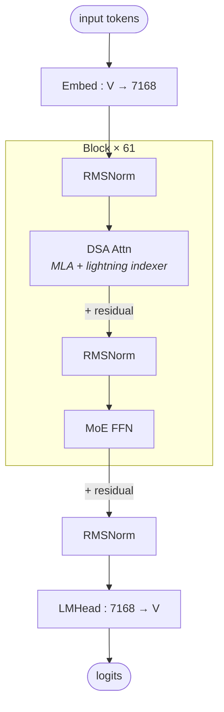

# DeepSeek V3.2-Exp architecture (block-level)

## Model summary

| Field          | Value             |
|----------------|-------------------|
| modality       | text              |
| attention_type | dsa               |
| ffn_type       | moe-shared+routed |
| params         | 671BA37B          |

## Modules (in forward order)

| #  | Module    | Type      | Count | Detail                |
|----|-----------|-----------|-------|-----------------------|
| 1  | Embed     | embed     | 1     | —                     |
| 2  | RMSNorm   | norm      | 61    | —                     |
| 3  | DSA Attn  | attn      | 61    | [[dsa]]               |
| 4  | RMSNorm   | norm      | 61    | —                     |
| 5  | MoE FFN   | ffn-moe   | 58    | [[moe-shared-routed]] |
| 5* | Dense FFN | ffn-dense | 3     | —                     |
| 6  | RMSNorm   | norm      | 1     | —                     |
| 7  | LMHead    | head      | 1     | —                     |

Position 5 alternates by layer index: `ffn-dense` for layers 1–3, `ffn-moe` for layers 4–61 (`first_k_dense_replace=3`).

The attention module is named `DSA Attn` because the indexer is structurally part of the same attention block (in the bundled code, the `Indexer` is instantiated as `self.indexer` inside the `MLA` class and called from inside `MLA.forward`). The Detail link is `[[dsa]]`, not `[[mla]]`, because DSA's structural identity is *MLA + indexer* — the indexer fan-out is not visible in the [[mla]] diagram. Readers needing the inner MLA Q/K/V detail follow [[mla]] from inside [[dsa]].

## Key parameters

| Module  | Param            | Value    |
|---------|------------------|----------|
| —       | n_layers         | 61       |
| —       | hidden           | 7168     |
| —       | vocab            | 129280   |
| MLA     | n_heads          | 128      |
| MLA     | q_lora_rank      | 1536     |
| MLA     | kv_lora_rank     | 512      |
| MLA     | qk_nope_head_dim | 128      |
| MLA     | qk_rope_head_dim | 64       |
| MLA     | v_head_dim       | 128      |
| Indexer | index_n_heads    | 64       |
| Indexer | index_head_dim   | 128      |
| Indexer | index_topk       | 2048     |
| MoE     | n_routed_experts | 256      |
| MoE     | n_shared_experts | 1        |
| MoE     | top_k            | 8        |
| MoE     | moe_intermediate | 2048     |
| MoE     | dense_layers     | 1–3 only |
| MTP     | num_nextn_predict_layers | 1 (config field; **not realized in bundled `inference/model.py`** — see Notes) |
| RoPE    | rope_theta       | 10000    |
| RoPE    | yarn factor      | 40       |
| RoPE    | original_max_pos | 4096     |
| —       | max_position_embeddings | 163840 |

## Notes

- **DSA wraps MLA, does not replace it.** In `inference/model.py` the attention class is `MLA`, which still computes the full MLA Q/KV LoRA graph (`wq_a / wq_b`, `wkv_a / wkv_b`, `q_norm`, `kv_norm`, NoPE+RoPE concat, `c_KV + k_rope` cache). The new piece is `self.indexer = Indexer(args)`: a parallel module called from inside `MLA.forward` after Q/KV are computed; it returns `topk_indices` of shape `[bsz, seqlen, index_topk]`, which `MLA` scatters into an additive `−inf` mask (`index_mask = scatter(−inf, topk_indices, 0)`) and sums into the raw attention scores **before softmax**. So the forward order is: MLA Q/KV → indexer → mask-from-topk → MLA score + mask → softmax → MLA `· v` → `W_O`. See [[dsa]] for the indexer's internal graph.
- **Indexer fan-out (why DSA is not `[[mla]]`)**: the indexer adds three new projections (`wq_b` from `qr` = MLA's `c_Q`-side intermediate; `wk` and `weights_proj` from the block input `x`), a `LayerNorm` on the indexer K, its own RoPE on the `*_pe` halves of indexer Q/K, a Hadamard `rotate_activation`, FP8 quantization of indexer Q/K, an FP8 indexer K-cache (`k_cache` / `k_scale_cache` registered as buffers on the `Indexer`), and a per-head importance projection (`weights_proj`, FP32). None of this is visible in the [[mla]] diagram, hence the dedicated `[[dsa]]` structural file.
- **Two RoPE flavors in one attention block**: per the inference README, "the input tensor to RoPE in the indexer module requires a non-interleaved layout, whereas RoPE in the MLA module expects an interleaved layout." Two RoPE invocations per block, two different layouts.
- **`q_lora_rank` is shared between MLA and the indexer**: the indexer's `wq_b` consumes `qr` (the post-`wq_a` Q intermediate at width `q_lora_rank=1536`), reusing MLA's LoRA Q-side compute rather than projecting from `x` independently.
- **DSA degrades gracefully at short context**: the implementation clamps to `min(index_topk, end_pos)`, so at sequences shorter than 2048 tokens DSA selects all tokens (no sparsity loss, no quality difference vs. plain MLA at short context). The performance/efficiency story of DSA is a long-context one.
- **MoE structure matches V3 exactly** (`n_routed_experts=256`, `n_shared_experts=1`, `num_experts_per_tok=8`, `moe_intermediate_size=2048`, `topk_method=noaux_tc`, `routed_scaling_factor=2.5`, `n_group=8`, `topk_group=4`). Per-token active expert count is `top_k + n_shared_experts = 9`. See [[moe-shared-routed]] for the shared+routed structure; the DeepSeek auxiliary-loss-free balancing (bias-only per-expert adjustment) is a per-model variation, not a structural difference, and so does not earn its own module file.
- **Dense FFN at layers 1–3** (`first_k_dense_replace=3`), same as V3. `intermediate_size=18432` (dense FFN width) — larger than V3's, since at hidden=7168 a comparable expansion ratio gives 4×hidden ≈ 28672 with SwiGLU-induced shrinkage to 18432. Row 5* of the Modules table captures this.
- **MTP is configured but not realized in the bundled inference code.** `config.json` exposes `num_nextn_predict_layers=1`, but `inference/model.py` defines no MTP / NextNPredictor / multi-head class — the `Transformer.forward` returns logits from a single `head = ColumnParallelLinear(dim, vocab_size)` and only the last token's logits at decode. Per § 1a verified-only, this means: MTP weights exist in the safetensors (DeepSeek-V3-style MTP weights are part of the checkpoint and would be loaded by training-mode code) but the architectural graph is **not** present in V3.2-Exp's released inference code, so this skill does **not** create an `mtp.md` module file and does not list `mtp` in the Modules table. A future commit can add the MTP module file once a verified MTP forward pass (training-mode code or an updated inference file) becomes available.
- **Quantization (`fp8` e4m3 with `weight_block_size=[128,128]` and `scale_fmt=ue8m0`)** is a deployment overlay and out of scope for this prior; recorded here only because the indexer's FP8 K-cache is part of its structural identity (see [[dsa]] Notes).
- **YaRN RoPE scaling**: `rope_scaling.type=yarn`, `factor=40`, `original_max_position_embeddings=4096`, giving `max_position_embeddings=163840`. `mscale=1.0` and `mscale_all_dim=1.0` (V3.2 disables the V3-era magnitude rescaling).
- **Diff vs [[deepseek-v3-architecture]]**: same `n_layers=61`, `hidden=7168`, `vocab=129280`, same MoE block (256+1, top-8, moe_inter=2048, noaux_tc), same MLA Q/K/V dims and head count, same first-3-dense FFN pattern, same `tie_word_embeddings=false`. The only structural difference is the attention identity: V3 = `mla`, V3.2-Exp = `dsa` (MLA + lightning indexer). The numerical additions are `index_n_heads=64`, `index_head_dim=128`, `index_topk=2048` and the `num_nextn_predict_layers=1` config flag (currently unrealized in inference).

## Source basis

Topology and counts transcribed from `deepseek-ai/DeepSeek-V3.2-Exp/config.json`
(verified 2026-05-15: `architectures=["DeepseekV32ForCausalLM"]`, `model_type=deepseek_v32`).
Forward-pass composition (DSA = MLA + lightning indexer; indexer is a member of MLA; indexer output is converted to a top-k mask added to attention scores pre-softmax) verified against
`deepseek-ai/DeepSeek-V3.2-Exp/inference/model.py` (verified 2026-05-15), specifically the `Block.forward`, `MLA.__init__` / `MLA.forward`, and `Indexer.__init__` / `Indexer.forward` methods.
MTP status (configured but not realized) verified by reading `Transformer.__init__` / `Transformer.forward` in the same file: only one output head exists (`self.head = ColumnParallelLinear(dim, vocab_size)`) and no `MTP` / `NextNPredictor` class is defined.
The block-level topology aligns with the sibling-skill image (`model-architecture-diagram :: deepseek-v3-2-exp-architecture`); the DSA detail diagram in [[dsa]] cross-references the sibling-skill DSA-MHA / DSA-MQA images.
