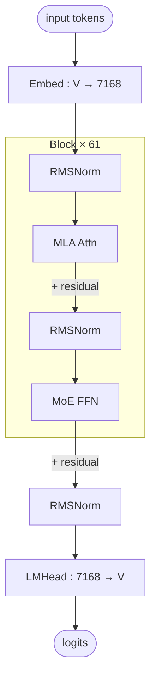

# DeepSeek V3 architecture (block-level)

## Model summary

| Field          | Value             |
|----------------|-------------------|
| modality       | text              |
| attention_type | mla               |
| ffn_type       | moe-shared+routed |
| params         | 671BA37B          |

## Modules (in forward order)

| #  | Module    | Type      | Count | Detail                |
|----|-----------|-----------|-------|-----------------------|
| 1  | Embed     | embed     | 1     | —                     |
| 2  | RMSNorm   | norm      | 61    | —                     |
| 3  | MLA Attn  | attn      | 61    | [[mla]]               |
| 4  | RMSNorm   | norm      | 61    | —                     |
| 5  | MoE FFN   | ffn-moe   | 58    | [[moe-shared-routed]] |
| 5* | Dense FFN | ffn-dense | 3     | —                     |
| 6  | RMSNorm   | norm      | 1     | —                     |
| 7  | LMHead    | head      | 1     | —                     |

Position 5 alternates by layer index: `ffn-dense` for layers 1–3, `ffn-moe` for layers 4–61.

## Key parameters

| Module | Param            | Value    |
|--------|------------------|----------|
| —      | n_layers         | 61       |
| —      | hidden           | 7168     |
| —      | vocab            | 129280   |
| MLA    | n_heads          | 128      |
| MLA    | q_lora_rank      | 1536     |
| MLA    | kv_lora_rank     | 512      |
| MLA    | qk_nope_head_dim | 128      |
| MLA    | qk_rope_head_dim | 64       |
| MLA    | v_head_dim       | 128      |
| MoE    | n_routed_experts | 256      |
| MoE    | n_shared_experts | 1        |
| MoE    | top_k            | 8        |
| MoE    | moe_intermediate | 2048     |
| MoE    | dense_layers     | 1–3 only |

## Notes

- Layers 1–3 use a dense FFN; layers 4–61 use MoE (`first_k_dense_replace=3` in config). The diagram shows the MoE path (the common case); the dense-FFN substitution at the first three layers is not drawn separately.
- MLA decomposes Q/K/V via low-rank latents (`c_Q` dim 1536, `c_KV` dim 512) and applies RoPE only to a small per-head sub-dimension. See [[mla]] for the full MLA forward (shared structural pattern).
- KV cache stores `c_KV` (512) + a single shared `k_rope` (64), far smaller than vanilla MHA caching full K/V per head.
- DeepSeek MoE uses **auxiliary-loss-free** load balancing (`topk_method=noaux_tc` in config; bias-only per-expert adjustment) — a per-model variation on the shared [[moe-shared-routed]] structure; Hunyuan-A13B uses standard auxiliary-loss balancing on the same structure.
- DeepSeek R1 reuses this exact architecture (same `model_type=deepseek_v3`, same `DeepseekV3ForCausalLM` class); aliases are co-listed in frontmatter.
- **DeepSeek V3.2-Exp is a separate model** (`model_type=deepseek_v32`, `architectures=DeepseekV32ForCausalLM`). Per the official V3.2 model card, V3.2's attention mechanism is called **DSA (DeepSeek Sparse Attention)** and is described as architecturally **coexisting** with MLA (the card explicitly references both "RoPE in the indexer module" and "RoPE in the MLA module" as separate components). The exact composition order (e.g. whether DSA selects tokens consumed by MLA, runs in parallel, or interleaves) is not stated publicly in plain English and has not been verified against modeling code in this skill — V3.2 ships custom inference code (FlashMLA / DeepGEMM / TileLang) rather than a standard HF `modeling_*.py`. V3.2 is **deliberately not authored here yet**; do **not** alias V3.2 onto this V3 file. Authoring V3.2 requires reading that custom inference code, and will produce a separate `deepseek-v3.2-architecture.md` plus a `dsa.md` and likely an `mtp.md` (V3.2 sets `num_nextn_predict_layers=1`).

## Source basis

Topology transcribed from the InfraTech architecture image
(`model-architecture-diagram` skill, entry id `deepseek-v3-architecture`,
file `models/deepseek_v3/deepseek_v3_architecture.jpg`).
Numerical fields verified against `deepseek-ai/DeepSeek-V3/config.json` on 2026-05-14
(`architectures=DeepseekV3ForCausalLM`, `model_type=deepseek_v3`).
DeepSeek R1 reuses this exact architecture class; this file covers both.
