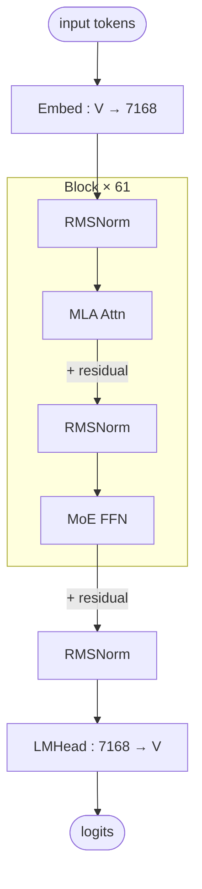

# DeepSeek V3.2 architecture (block-level)

## Model summary

| Field          | Value             |
|----------------|-------------------|
| modality       | text              |
| attention_type | mla               |
| ffn_type       | moe-shared+routed |
| params         | 671BA37B          |

## Modules (in forward order)

| #  | Module    | Type      | Count | Detail                |
|----|-----------|-----------|-------|-----------------------|
| 1  | Embed     | embed     | 1     | —                     |
| 2  | RMSNorm   | norm      | 61    | —                     |
| 3  | MLA Attn  | attn      | 61    | [[mla]]               |
| 4  | RMSNorm   | norm      | 61    | —                     |
| 5  | MoE FFN   | ffn-moe   | 58    | [[moe-shared-routed]] |
| 5* | Dense FFN | ffn-dense | 3     | —                     |
| 6  | RMSNorm   | norm      | 1     | —                     |
| 7  | LMHead    | head      | 1     | —                     |

Position 5 alternates by layer index: `ffn-dense` for layers 1–3, `ffn-moe` for layers 4–61.

## Key parameters

| Module | Param            | Value    |
|--------|------------------|----------|
| —      | n_layers         | 61       |
| —      | hidden           | 7168     |
| —      | vocab            | 129280   |
| MLA    | n_heads          | 128      |
| MLA    | q_lora_rank      | 1536     |
| MLA    | kv_lora_rank     | 512      |
| MLA    | qk_nope_head_dim | 128      |
| MLA    | qk_rope_head_dim | 64       |
| MLA    | v_head_dim       | 128      |
| MoE    | n_routed_experts | 256      |
| MoE    | n_shared_experts | 1        |
| MoE    | top_k            | 8        |
| MoE    | moe_intermediate | 2048     |
| MoE    | dense_layers     | 1–3 only |

## Notes

- Layers 1–3 use a dense FFN; layers 4–61 use MoE. The diagram shows the MoE path (the common case); the dense-FFN substitution at the first three layers is not drawn separately.
- MLA decomposes Q/K/V via low-rank latents (`c_Q` dim 1536, `c_KV` dim 512) and applies RoPE only to a small per-head sub-dimension. See [[mla]] for the full MLA forward (shared structural pattern).
- KV cache stores `c_KV` (512) + a single shared `k_rope` (64), far smaller than vanilla MHA caching full K/V per head.
- DeepSeek MoE uses **auxiliary-loss-free** load balancing (bias-only per-expert adjustment) — a per-model variation on the shared [[moe-shared-routed]] structure; Hunyuan-A13B uses standard auxiliary-loss balancing on the same structure.
- DeepSeek R1 shares the same architecture as DeepSeek V3 / V3.2 — aliases are co-listed here.

## Source basis

Topology transcribed from the InfraTech architecture image
(`model-architecture-diagram` skill, entry id `deepseek-v3-architecture`).
Numerical fields cross-checked against `deepseek-ai/DeepSeek-V3.2-Exp/config.json` and
`modeling_deepseek.py`.
