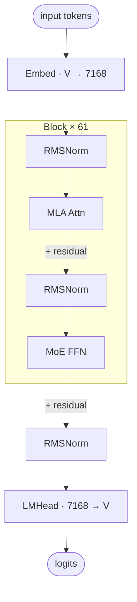

# DeepSeek V3.2 architecture (block-level)

## Key parameters

| Module | Param            | Value    |
|--------|------------------|----------|
| —      | n_layers         | 61       |
| —      | hidden           | 7168     |
| —      | vocab            | 129280   |
| MLA    | n_heads          | 128      |
| MLA    | q_lora_rank      | 1536     |
| MLA    | kv_lora_rank     | 512      |
| MLA    | qk_nope_head_dim | 128      |
| MLA    | qk_rope_head_dim | 64       |
| MLA    | v_head_dim       | 128      |
| MoE    | n_routed_experts | 256      |
| MoE    | n_shared_experts | 1        |
| MoE    | top_k            | 8        |
| MoE    | moe_intermediate | 2048     |
| MoE    | dense_layers     | 1–3 only |

## Notes

- Layers 1–3 use a dense FFN; layers 4–61 use MoE. The diagram shows the MoE path (the common case); the dense-FFN substitution at the first three layers is not drawn separately.
- MLA decomposes Q/K/V via low-rank latents (`c_Q` dim 1536, `c_KV` dim 512) and applies RoPE only to a small per-head sub-dimension. See [[deepseek-v3.2-mla]] for the full MLA forward.
- KV cache stores `c_KV` (512) + a single shared `k_rope` (64), far smaller than vanilla MHA caching full K/V per head.
- DeepSeek R1 shares the same architecture as DeepSeek V3 / V3.2 — aliases are co-listed here.

## Source basis

Topology transcribed from the InfraTech architecture image
(`model-architecture-diagram` skill, entry id `deepseek-v3-architecture`).
Numerical fields cross-checked against `deepseek-ai/DeepSeek-V3.2-Exp/config.json` and
`modeling_deepseek.py`.
