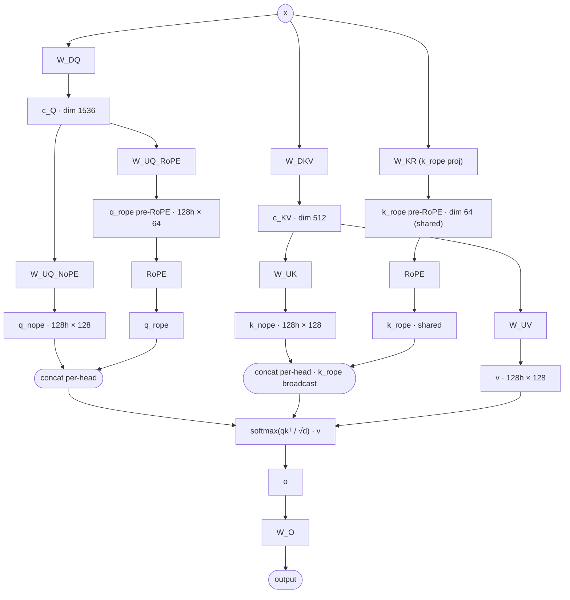

# DeepSeek V3.2 MLA forward

## Key parameters

| Field              | Value | Notes                                            |
|--------------------|-------|--------------------------------------------------|
| n_heads            | 128   | per-head; both Q and K have 128 heads            |
| q_lora_rank        | 1536  | c_Q dimension                                    |
| kv_lora_rank       | 512   | c_KV dimension                                   |
| qk_nope_head_dim   | 128   | per-head NoPE part of Q/K                        |
| qk_rope_head_dim   | 64    | per-head RoPE part of Q; k_rope is shared (1×64) |
| v_head_dim         | 128   | per-head V dim                                   |
| effective_head_dim | 192   | concat(nope, rope) per head for attention        |

## Notes

- The "MLA" trick: instead of materializing full K/V per head (128 × 256 dims), the model caches the low-rank latent `c_KV` (512) plus a single shared `k_rope` (64). At decode time, K/V per head are reconstructed on the fly from `c_KV`.
- `k_rope` is **shared across all heads** (one 64-dim vector, broadcast). `q_rope` is per-head.
- Per-head attention dim is `qk_nope_head_dim + qk_rope_head_dim = 128 + 64 = 192`, not 128. Plan kernel shapes accordingly.
- Output projection `W_O` consumes a per-head V (dim 128); attention output is `(n_heads · 128) = 16384` wide before W_O collapses it back to `hidden = 7168`.
- This entry is the detail companion to [[deepseek-v3.2-architecture]].

## Source basis

Topology transcribed from the InfraTech MLA-MHA diagram
(`model-architecture-diagram` skill, entry id `deepseek-v3-mla-mha`),
with the K-rope branch made explicit (the original image keeps it implicit).
Numerical fields from `deepseek-ai/DeepSeek-V3.2-Exp/config.json` and `modeling_deepseek.py`.
