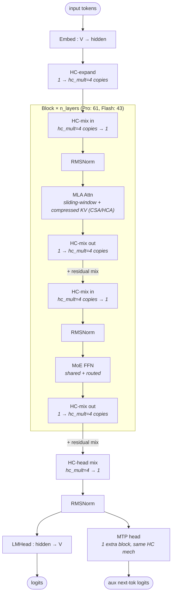

# DeepSeek V4 architecture (block-level)

## Model summary

| Field          | Value             |
|----------------|-------------------|
| modality       | text              |
| attention_type | mla               |
| ffn_type       | moe-shared+routed |
| params         | V4-Pro: 1.6TA49B · V4-Flash: 284BA13B |

## Modules (in forward order)

| #  | Module            | Type    | Count                  | Detail |
|----|-------------------|---------|------------------------|--------|
| 1  | Embed             | embed   | 1                      | —      |
| 2  | HC-expand         | norm    | 1                      | —      |
| 3  | RMSNorm           | norm    | n_layers               | —      |
| 4  | MLA Attn (CSA/HCA)| attn    | n_layers               | —      |
| 5  | RMSNorm           | norm    | n_layers               | —      |
| 6  | MoE FFN           | ffn-moe | n_layers               | [[moe-shared-routed]] |
| 7  | RMSNorm           | norm    | 1                      | —      |
| 8  | LMHead            | head    | 1                      | —      |
| 9  | MTP head          | mtp     | 1 (`num_nextn_predict_layers=1`) | — |

`n_layers` resolves to **61** for V4-Pro and **43** for V4-Flash. Every layer uses the same Block topology; there is no dense-FFN warm-up region. The HC-expand at row 2 is the one-shot post-embed lift to `hc_mult` parallel copies; every block's `HC-mix in` / `HC-mix out` pair (drawn inside the subgraph above) is a per-block mixing of those copies and is counted under "RMSNorm + Attn / MoE" rather than as a separate module row.

## Key parameters

Two configurations share the same `model_type=deepseek_v4` and `architectures=["DeepseekV4ForCausalLM"]`; only the shapes differ.

| Module        | Param                        | V4-Pro       | V4-Flash     |
|---------------|------------------------------|--------------|--------------|
| —             | n_layers (`num_hidden_layers`) | 61         | 43           |
| —             | hidden (`hidden_size`)       | 7168         | 4096         |
| —             | vocab (`vocab_size`)         | 129280       | 129280       |
| —             | max_position_embeddings      | 1048576      | 1048576      |
| —             | rope_theta                   | 10000        | 10000        |
| —             | rope_scaling.original_max_position_embeddings | 65536 | 65536  |
| —             | rope_scaling.factor (yarn)   | 16           | 16           |
| —             | sliding_window               | 128          | 128          |
| MLA-style attn| n_heads (`num_attention_heads`) | 128       | 64           |
| MLA-style attn| num_key_value_heads          | 1            | 1            |
| MLA-style attn| head_dim                     | 512          | 512          |
| MLA-style attn| q_lora_rank                  | 1536         | 1024         |
| MLA-style attn| qk_rope_head_dim             | 64           | 64           |
| MLA-style attn| o_lora_rank                  | 1024         | 1024         |
| MLA-style attn| o_groups                     | 16           | 8            |
| Indexer (CSA) | index_head_dim               | 128          | 128          |
| Indexer (CSA) | index_n_heads                | 64           | 64           |
| Indexer (CSA) | index_topk                   | 1024         | 512          |
| Indexer (CSA) | compress_rope_theta          | 160000       | 160000       |
| MoE           | n_routed_experts             | 384          | 256          |
| MoE           | n_shared_experts             | 1            | 1            |
| MoE           | top_k (`num_experts_per_tok`)| 6            | 6            |
| MoE           | moe_intermediate_size        | 3072         | 2048         |
| MoE           | routed_scaling_factor        | 2.5          | 1.5          |
| MoE           | scoring_func                 | sqrtsoftplus | sqrtsoftplus |
| MoE           | topk_method                  | noaux_tc     | noaux_tc     |
| MoE           | num_hash_layers              | 3            | 3            |
| MoE           | swiglu_limit                 | 10.0         | 10.0         |
| Hyper-Conn    | hc_mult                      | 4            | 4            |
| Hyper-Conn    | hc_sinkhorn_iters            | 20           | 20           |
| Hyper-Conn    | hc_eps                       | 1e-6         | 1e-6         |
| MTP           | num_nextn_predict_layers     | 1            | 1            |

Per-token activated expert count is **7** for both variants (top-6 routed + 1 shared). The `params` summary `1.6TA49B` / `284BA13B` comes from the official model card (verified 2026-05-15); the configs alone do not state total / activated counts, but `top_k=6 + n_shared=1` is consistent with the card's "activated params" arithmetic.

## Notes

- **`attention_type=mla` with substantial extensions.** The bundled inference code (`inference/model.py` in the HF repo) defines `class Attention(nn.Module)` whose Q path is the canonical MLA low-rank LoRA (`wq_a` → RMSNorm → `wq_b`) with RoPE applied only to the last `qk_rope_head_dim=64` dims of each per-head Q; the K/V path is a single `wkv` projection followed by `kv_norm` and the same partial RoPE. This places V4 within the MLA family. Three V4-specific extensions sit on top of that base — they are documented here in Notes rather than via `[[mla]]` because the shared `mla.md` does not draw them:
  1. **Sliding-window dense path.** `sliding_window=128` selects a local window of recent tokens for every query.
  2. **Compressed sparse path (CSA).** A `Compressor` module pools KV over `compress_ratios[i]` tokens (per-layer schedule) and an `Indexer` module (`index_n_heads=64`, `index_head_dim=128`, `index_topk=1024` for Pro / `512` for Flash, `compress_rope_theta=160000`) scores compressed KV slots and selects the top-`index_topk`. The model card calls this **Compressed Sparse Attention (CSA)**; it is conceptually adjacent to V3.2's DSA indexer but is named and parameterized differently.
  3. **Heavily Compressed Attention (HCA).** The model card names a second compression regime active on a subset of layers governed by `compress_ratios` (a length-`n_layers` list with values in `{0, 4, 128}` — `0` disables compression at that layer; `4` and `128` set the per-layer compression ratio). Layers with `0` ratio fall back to sliding-window MLA only; layers with `4` or `128` activate the CSA/HCA indexer path.
  4. **Grouped output low-rank projection.** Output projection is split into `o_groups` parallel low-rank projections of rank `o_lora_rank=1024` per group — a structural feature absent from V3's MLA. Pro uses 16 groups (`128 heads / 16 = 8 heads per group`); Flash uses 8 groups (`64 / 8 = 8`).
  5. **Per-head `head_dim=512` is unusually large** vs V3's `qk_nope_head_dim=128`. This reflects that the verified-shape per-head V/K state in V4 already absorbs what V3 splits into separate nope/rope dims; the last 64 of those 512 are the RoPE sub-dim (`qk_rope_head_dim=64`). KV-cache shapes follow per-head 512 minus the per-layer compression schedule.
  A V4-specific `csa-hca.md` and a separate `mhc.md` are deliberately **not** authored in this commit (per `authoring-policy.md` § 6: extending the module catalogue is a separate, named decision). Until then this skill exposes only the block-level V4 file; downstream agents needing per-component graphs should read the bundled `inference/model.py` directly.
- **Manifold-constrained Hyper-Connections (mHC).** The block's residual stream is not a single tensor — it is `hc_mult=4` parallel copies. Each sub-block (attn, then ffn) is wrapped by an `HC-mix in` (Sinkhorn-weighted reduction from `hc_mult` copies to 1) and an `HC-mix out` (post-weight + combination-matrix re-expansion). The Sinkhorn step uses `hc_sinkhorn_iters=20` and `hc_eps=1e-6`. This replaces the conventional `x + sublayer(norm(x))` residual; the V4 model card names it **manifold-constrained hyper-connections (mHC)**, and it is described in the bundled technical report (`DeepSeek_V4.pdf` in the HF repo). The diagram above draws the per-sub-block HC-mix wrappers explicitly so kernel-planning agents see that the residual is a 4-way structure, not a 1-way add.
- **MoE structural pattern is shared with `[[moe-shared-routed]]`.** Per-token combine is the same `y = shared(x) + Σ_{i∈top-k}(g_i · routed_i(x))` topology verified in `MoE.forward`. The shared expert is always-on; the routed branch picks top-6 of 384 (Pro) / 256 (Flash). V4-specific variations on this shared pattern, all per-model Notes (not changes to the module file):
  - **Routing score**: `scoring_func="sqrtsoftplus"` → `softplus(logits).sqrt()`, distinct from V3's sigmoid and Qwen3's softmax routing; weights are re-normalized to sum to 1 across top-k.
  - **Aux-loss-free balancing** with bias-only adjustment (`topk_method=noaux_tc`), same family as V3.
  - **Hash-routed warm-up**: the first `num_hash_layers=3` MoE layers do **not** use score-based routing — they use a deterministic token-id → predetermined expert-id table (`tid2eid[input_ids]`). Score-based top-k routing only kicks in at layer 4. This is V4's analogue to V3's "first 3 layers dense FFN" pattern, but instead of substituting a dense FFN, V4 keeps the MoE block and replaces just the routing rule.
  - **Expert FFN clamping**: SwiGLU outputs are clamped to `±swiglu_limit=10.0` for stability.
  - **Routed scaling**: per-token routed weights are multiplied by `routed_scaling_factor` (2.5 for Pro, 1.5 for Flash) before the combine sum.
- **Multi-Token Prediction (MTP)**: `num_nextn_predict_layers=1` instantiates one `MTPBlock` whose forward is `e_proj(embed(input_ids)) + h_proj(hc_normed_hidden)` followed by a full Block forward, then an HC-head readout — i.e. an extra prediction-layer reusing the same Block + HC machinery. The MTP head is wired in parallel to `LMHead` (both consume the final hidden state via independent HC-head mixers in the bundled inference code), not in series. Drawn above as a parallel head; tokens emitted are auxiliary next-token predictions.
- **KV-cache shape**: the bundled code stores per-layer per-head latent `wkv(x)` output of shape `head_dim=512`, with per-layer compression ratio from `compress_ratios[i]`. Layers with ratio `0` cache full-resolution KV within the sliding window of 128. Layers with ratio `4` or `128` cache a compressed representation accessed via the Indexer.
- **Quantization (not part of architecture, but in config):** V4-Pro / V4-Flash use FP4 for MoE expert weights (`expert_dtype="fp4"`) and FP8 for everything else; the `-Base` variants use FP8 throughout. Activation quantization is dynamic FP8 with a 128×128 weight block size. Per the skill's stock-HF-model scope (`authoring-policy.md` § 0), these are quantization-deployment overlays and are listed only for cross-reference; the diagram is precision-independent.
- **Not aliased onto V3.** V3 (`model_type=deepseek_v3`) does not have the indexer, the grouped O-LoRA, the hash routing layers, the `sqrtsoftplus` scoring, the hyper-connections, the sliding window, or per-layer KV compression. Treating V4 as "V3 with bigger numbers" is incorrect and is explicitly the kind of speculative aliasing § 1a forbids. The aliases listed in frontmatter cover both V4 size variants and the `-Base` quant variants; **R1**, **V3**, and **V3.2** are NOT aliases.

## Source basis

Architecture transcribed from the V4-Pro bundled `inference/model.py`
(`deepseek-ai/DeepSeek-V4-Pro` HF repo; class names quoted in Notes: `Transformer`, `Block`, `Attention`, `Compressor`, `Indexer`, `MoE`, `Gate`, `Expert`, `MTPBlock`).
Numerical fields verified against `deepseek-ai/DeepSeek-V4-Pro/config.json` and `deepseek-ai/DeepSeek-V4-Flash/config.json` (both fetched 2026-05-15; `architectures=["DeepseekV4ForCausalLM"]`, `model_type=deepseek_v4`, `transformers_version=4.57.1`).
Architectural-feature names (CSA / HCA / mHC) and Pro/Flash total-and-activated parameter counts cross-checked against the model card README (`deepseek-ai/DeepSeek-V4-Pro/README.md`, verified 2026-05-15).
MoE structural pattern shared with [[moe-shared-routed]]; per-model variations (sqrtsoftplus scoring, hash-routed warm-up, routed scaling factor) noted above. The sibling `model-architecture-diagram` skill carries the corresponding V4 architecture image at entry id `deepseek-v4-architecture`; this skill uses that image for abstraction-level reference only — all numerical fields here come from the verified configs.
