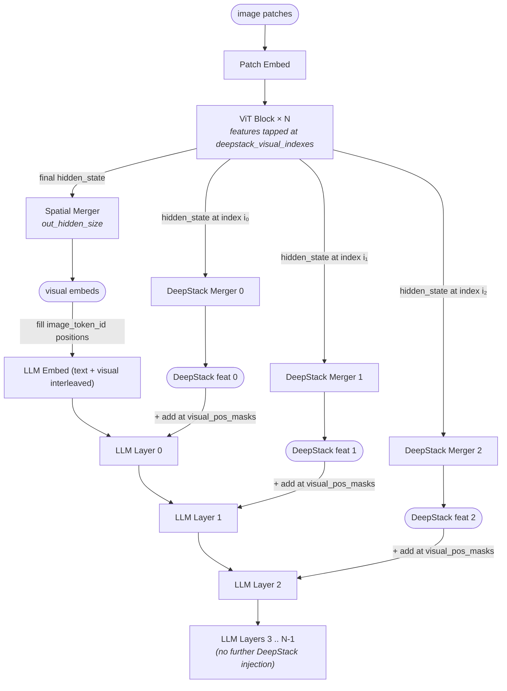

# DeepStack multi-level visual feature injection — structural pattern

> Model-agnostic structural diagram for the DeepStack pattern: multiple intermediate features pulled from a ViT, then added (element-wise) to the LLM's hidden state at image-token positions across the first several LLM layers. Numerical specifics (which ViT layers, how many injection points, hidden dims) live in each consuming model's own file. Verified to apply to: Qwen3-VL-32B (per HF transformers `modeling_qwen3_vl.py`) and Qwen3-VL-235B-A22B (per HF transformers `modeling_qwen3_vl_moe.py`, same `_deepstack_process` mechanism in `Qwen3VLMoeTextModel`).



## Key parameters (per-model values)

These parameter names describe the DeepStack instance in a consuming model's config; concrete values are not part of this module file.

| Param                       | Describes                                                                 |
|-----------------------------|---------------------------------------------------------------------------|
| `deepstack_visual_indexes`  | List of ViT layer indices at which intermediate features are tapped (e.g. `[8, 16, 24]`). Length determines the number of injection points. |
| `n_injection_points`        | Equals `len(deepstack_visual_indexes)`; the corresponding features are injected into the **first N LLM layers** (LLM layers `0 .. N-1`), in order. |
| ViT `hidden_size`           | Width of intermediate ViT features before the DeepStack merger.            |
| LLM `hidden_size`           | Output width of each DeepStack merger (the LLM's hidden dim) — features must be projected to LLM width before the add. |
| `image_token_id` / `video_token_id` | Vocab ids that mark visual-token positions in the LLM input; the LLM-side mask `visual_pos_masks = image_mask | video_mask` (both image and video tokens contribute), built in `Qwen3VLModel.forward`. |

## Notes

- **Verified injection operation** (from transformers `modeling_qwen3_vl.py`, `Qwen3VLTextModel._deepstack_process`, verbatim):

  ```python
  def _deepstack_process(
      self, hidden_states: torch.Tensor, visual_pos_masks: torch.Tensor, visual_embeds: torch.Tensor
  ):
      visual_pos_masks = visual_pos_masks.to(hidden_states.device)
      visual_embeds = visual_embeds.to(hidden_states.device, hidden_states.dtype)
      hidden_states = hidden_states.clone()
      local_this = hidden_states[visual_pos_masks, :] + visual_embeds
      hidden_states[visual_pos_masks, :] = local_this
      return hidden_states
  ```

  Element-wise add at visual-token positions only (text-token positions untouched). The call site is **after** `decoder_layer(...)` returns: the add lands on the layer's output, which is the next layer's input. The two leading `.to(...)` calls align device + dtype with the decoder's hidden state. The MoE sibling `modeling_qwen3_vl_moe.py` defines an identical `_deepstack_process` directly on `Qwen3VLMoeTextModel` (not via inheritance).

- **Layer-index mapping** (verified): DeepStack feature *i* (from ViT layer `deepstack_visual_indexes[i]`) is injected into LLM layer *i*. The mapping is by enumeration order of `deepstack_visual_indexes`, **not** by matching layer numbers. So with `deepstack_visual_indexes=[8, 16, 24]` and a 64-layer LLM: ViT-8 → LLM-0, ViT-16 → LLM-1, ViT-24 → LLM-2; LLM-3 .. 63 receive no DeepStack injection.

- **Why this pattern**: traditional VLMs fuse only the final ViT layer's features at the LLM embed. DeepStack additionally surfaces earlier ViT features (which carry finer-grained / lower-level visual detail) directly into the early LLM layers. The named effect is "fuses multi-level ViT features to capture fine-grained details and sharpen image–text alignment" (per Qwen3-VL model card).

- **Not part of this pattern**: cross-attention from text tokens to visual tokens, Q-Former / perceiver compression, prefix-tuning. DeepStack is strictly an *additive injection* at image-token positions; the rest of the attention computation is the LLM's normal self-attention over the combined text+visual sequence.

- **Out-of-distribution behavior**: if neither `image_token_id` nor `video_token_id` appears in the input (text-only prompt), `visual_pos_masks` is empty, the boolean-indexed slice is empty, and the add is functionally a no-op — Qwen3-VL falls back to pure-LLM behavior with the DeepStack code branch inert.

## Source basis

Topology anchored to the two self-llm reference images
(`model-architecture-diagram` skill entries `qwen3-vl-deepstack-feature-extraction`
and `qwen3-vl-visual-feature-injection`).
Forward-pass mechanism, layer-index mapping, and injection operation
verified against `huggingface/transformers` reference modeling code at
`src/transformers/models/qwen3_vl/modeling_qwen3_vl.py` on 2026-05-15
(`Qwen3VLVisionModel.forward` for the feature-extraction side and
`Qwen3VLTextModel._deepstack_process` for the injection side).
