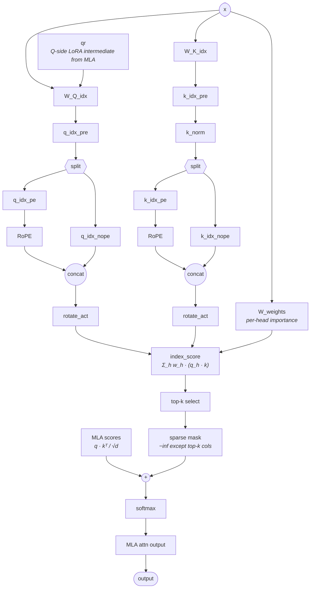

# DeepSeek Sparse Attention (DSA) — structural pattern

> Model-agnostic structural diagram. Verified to apply to: DeepSeek V3.2-Exp (`DeepseekV32ForCausalLM`, `model_type=deepseek_v32`; the `MLA` class in the bundled `inference/model.py` instantiates `self.indexer = Indexer(args)` and calls it from inside `MLA.forward`) and GLM-5 (`GlmMoeDsaForCausalLM`, `model_type=glm_moe_dsa`; `GlmMoeDsaAttention` contains `GlmMoeDsaIndexer` whose top-k indices form an additive `-inf` mask applied pre-softmax — verified against `transformers/main` `modeling_glm_moe_dsa.py`). Any future model whose attention class wraps an MLA-shaped Q/K/V graph with a learned indexer that emits a per-query top-k token mask reuses this file; per-model variation (rotation tricks, FP8 layout, indexer head count) goes in the model's own Notes. Numerical shapes (e.g. `index_n_heads=64`, `index_head_dim=128`, `index_topk=2048`) live in each model's `## Key parameters`, never here.
>
> **Relationship to MLA**: DSA is **MLA + indexer overlay**, not a replacement. The MLA Q / K / V projections, NoPE/RoPE split, `c_KV` cache, and softmax kernel are unchanged from [[mla]]. The indexer runs in parallel on the same `x` (and the same `c_Q`-equivalent intermediate `qr`) and produces an additive mask that zeros every non-top-k position before softmax. A model with `attention_type=dsa` therefore implicitly carries the full MLA forward graph — readers needing the inner MLA detail follow `[[mla]]` separately.

Avoid these mismatches when reading the diagram:

- The two RoPE boxes are the **indexer's** RoPE — applied to the indexer's `q_idx_pe` / `k_idx_pe`, not to MLA's `q_rope` / `k_rope`. Indexer RoPE consumes a *non-interleaved* layout; MLA RoPE consumes an *interleaved* layout. See Notes.
- `MLA scores` is the only edge into the diagram from the MLA path; it is the un-softmaxed `q · kᵀ / √d` from [[mla]]'s `softmax(qkᵀ / √d) · v` node (in [[mla]] the softmax is fused; in DSA it is split so the indexer mask can be added between).

## Key parameters (per-model values)

| Param           | Describes                                                                                                                          |
|-----------------|------------------------------------------------------------------------------------------------------------------------------------|
| `index_n_heads` | Number of indexer heads (independent of MLA's `n_heads`; the indexer is usually much smaller than the main attention).             |
| `index_head_dim`| Per-head width of the indexer Q / K (also independent of MLA's `qk_*_head_dim`).                                                   |
| `index_topk`    | Number of tokens per query position kept by the indexer; all other positions are zeroed in the additive mask before softmax.       |
| `q_lora_rank`   | Latent dim of MLA's `c_Q`; the indexer's Q-side projection `W_Q_idx` consumes this same `qr` tensor (parameter reuse with MLA).    |
| (RoPE sub-dim)  | Per-head RoPE component of the indexer's Q and K (a fraction of `index_head_dim`); the rest is NoPE.                               |

The MLA-side parameters (`kv_lora_rank`, `qk_nope_head_dim`, `qk_rope_head_dim`, `v_head_dim`, `n_heads`) belong to [[mla]] and are not restated here. A DSA model lists them in its own `## Key parameters` alongside the indexer fields.

## Notes

- **Indexer ⊆ MLA in the implementation**: the indexer is a member module of the attention class (`self.indexer = Indexer(args)` in `MLA.__init__`); it is not a sibling block. `MLA.forward` computes Q / KV, then calls `self.indexer(x, qr, ...)`, scatters the returned `topk_indices` into an additive `−inf` mask, sums it into the raw attention scores, and only then applies softmax. The MLA cache (`c_KV + k_rope`) is unchanged.
- **Two RoPE flavors live in the same attention block**: the indexer applies RoPE to its own `q_idx_pe / k_idx_pe` with a *non-interleaved* layout; MLA applies RoPE to `q_rope / k_rope` (see [[mla]]) with an *interleaved* layout. This is a known kernel-writer hazard — sharing one RoPE kernel across both paths is incorrect.
- **`rotate_act` (Hadamard transform) is applied to both indexer Q and K** before scoring; the resulting tensors are quantized to FP8 (`e4m3`) and the indexer's K-cache is stored at FP8 with a separate FP32 scale cache. This is a deployment detail noted here because the cache layout is part of the structural identity of DSA — it is the reason the indexer is cheap enough to run every layer.
- **Per-head importance weights**: `W_weights` (`weights_proj` in the bundled code, FP32) projects `x` to `n_idx_heads` scalars per token; these weight the per-head dot products inside the indexer score `Σ_h w_h · (q_h · k)`. Without these weights the indexer would be a flat-mean-over-heads scorer — instead it learns which indexer heads carry token-selection signal.
- **Prefill vs decode**: the diagram covers both. The only difference downstream is which MLA mode consumes the masked scores — MHA absorption at prefill (full per-head K / V materialized), MQA absorption at decode (per-head K / V reconstructed from `c_KV` on demand). The indexer path is identical in both; the sibling `model-architecture-diagram` skill splits DSA-MHA and DSA-MQA into two images for this reason.
- **`index_topk` capping**: if the running context length `< index_topk`, the implementation clamps to the running length (`min(index_topk, end_pos)`), so at short sequences DSA degrades gracefully into full attention.
- **Why this is not a `[[mla]]` link**: structurally, DSA's attention block has at least three parallel branches (MLA Q/K/V, indexer Q, indexer K + per-head weights) and three concat / merge points; [[mla]] alone has the first branch only. A model that uses DSA must link its attention row in `## Modules` to `[[dsa]]`, not `[[mla]]` — the [[mla]] file is a strict subgraph and would mislead a downstream agent counting fan-out for kernel planning.

## Source basis

Topology derived from `deepseek-ai/DeepSeek-V3.2-Exp/inference/model.py` (verified 2026-05-15), specifically the `MLA` class (which instantiates `self.indexer = Indexer(args)` and folds the indexer's `topk_indices` into the attention mask via `scatter_` → `+= index_mask`) and the `Indexer` class (projections `wq_b`, `wk`, `weights_proj`, `k_norm`, RoPE on the `*_pe` halves, `rotate_activation`, FP8 quant and K-cache, `index_score.topk(...)`). Cross-references to per-model files (`deepseek-v3-2-exp-architecture`, etc.) carry the concrete `index_n_heads`, `index_head_dim`, `index_topk` values and any per-model variation. Companion sibling-skill images (`DSA-MHA.jpg`, `DSA-MQA.jpg`) are the abstraction-level reference.
