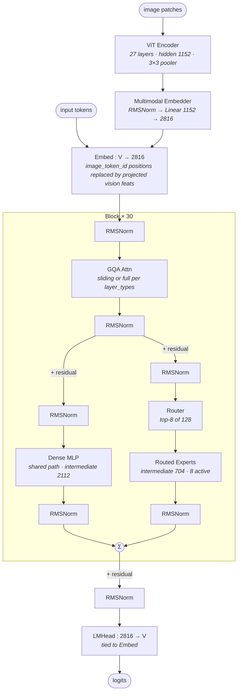

# Gemma 4 26B-A4B-it architecture (block-level)

## Model summary

| Field          | Value             |
|----------------|-------------------|
| modality       | text+vision       |
| attention_type | gqa               |
| ffn_type       | moe-shared+routed |
| params         | 26BA4B            |

`26BA4B` follows the HF model id (`gemma-4-26B-A4B-it`); the model card reports 25.2B total / 3.8B active for the LLM. The vision tower (~550M parameters per the card) is folded into deployment-time totals but the `params` field tracks the headline `BA<active>B` figure consistent with the HF naming convention.

## Modules (in forward order)

| #   | Module                  | Type            | Count             | Detail                |
|-----|-------------------------|-----------------|-------------------|-----------------------|
| V1  | ViT Patch Embedder      | vision-encoder  | 1                 | —                     |
| V2  | ViT Encoder             | vision-encoder  | 1 (27 layers)     | —                     |
| V3  | ViT Pooler              | vision-encoder  | 1 (3×3 kernel)    | —                     |
| V4  | Multimodal Embedder     | fusion          | 1                 | —                     |
| 1   | Embed (text + visual)   | embed           | 1                 | —                     |
| 2   | Input RMSNorm           | norm            | 30                | —                     |
| 3   | GQA Attn (sliding)      | attn            | 25                | —                     |
| 3*  | GQA Attn (full + pRoPE) | attn            | 5                 | —                     |
| 4   | Post-attn RMSNorm       | norm            | 30                | —                     |
| 5a  | Dense MLP (shared)      | ffn-moe         | 30                | [[moe-shared-routed]] |
| 5b  | Routed Experts (8/128)  | ffn-moe         | 30                | [[moe-shared-routed]] |
| 6   | Pre-feedforward norms (×2 inner) + post-feedforward norms (×3 outer) | norm | 5 × 30 | — |
| 7   | Final RMSNorm           | norm            | 1                 | —                     |
| 8   | LMHead                  | head            | 1                 | —                     |

V-prefixed rows run on the vision side before the LLM block loop. Rows 5a / 5b run **in parallel inside the same block**, each gated by its own pre-feedforward RMSNorm and followed by its own post-feedforward RMSNorm, then summed before the outer residual — both rows therefore share `Detail = [[moe-shared-routed]]` (the topology is one MoE-shared-routed instance per layer, just split across two rows because Gemma 4 instantiates the shared path as a wider FFN class than the routed experts). Rows 3 vs 3* alternate per `layer_types`: cycle length 6 = 5×sliding then 1×full, repeated 5 times for 30 layers (layer indices 5/11/17/23/29 are `full_attention`).

## Key parameters

### Text backbone (LLM)

| Module     | Param                       | Value (Gemma 4 26B-A4B-it) |
|------------|-----------------------------|----------------------------|
| —          | n_layers                    | 30                         |
| —          | hidden                      | 2816                       |
| —          | vocab                       | 262144                     |
| GQA-sliding| n_q_heads                   | 16                         |
| GQA-sliding| n_kv_heads                  | 8                          |
| GQA-sliding| head_dim                    | 256                        |
| GQA-sliding| sliding_window              | 1024                       |
| GQA-full   | n_q_heads                   | 16                         |
| GQA-full   | num_global_key_value_heads  | 2                          |
| GQA-full   | global_head_dim             | 512                        |
| GQA-full   | attention_k_eq_v            | true (K and V share proj — `v_proj=None`) |
| Dense MLP  | intermediate_size           | 2112                       |
| Dense MLP  | hidden_activation           | gelu_pytorch_tanh          |
| MoE        | num_experts                 | 128                        |
| MoE        | top_k_experts               | 8                          |
| MoE        | moe_intermediate_size       | 704                        |
| MoE        | router scoring              | softmax over all 128 → top-k → renorm to sum 1 → multiply by learned per-expert scale |
| RoPE       | rope_theta (sliding)        | 10,000                     |
| RoPE       | rope_theta (full)           | 1,000,000                  |
| RoPE       | partial_rotary_factor (full)| 0.25 (pRoPE — 25% of dims rotated) |
| RoPE       | rope_type (full)            | proportional               |
| —          | max_position_embeddings     | 262144                     |
| —          | rms_norm_eps                | 1e-06                      |
| —          | tie_word_embeddings         | true                       |
| —          | final_logit_softcapping     | 30.0                       |
| —          | num_kv_shared_layers        | 0 (no KV sharing across layers in this variant) |

### Vision encoder (ViT)

| Param                      | Value                                  |
|----------------------------|----------------------------------------|
| num_hidden_layers          | 27                                     |
| hidden_size                | 1152                                   |
| num_attention_heads        | 16                                     |
| num_key_value_heads        | 16 (no GQA on vision side)             |
| head_dim                   | 72                                     |
| intermediate_size          | 4304                                   |
| patch_size                 | 16                                     |
| pooling_kernel_size        | 3 (3×3 spatial pool before output)     |
| max_position_embeddings    | 131072                                 |
| position_embedding_size    | 10240                                  |
| rope_theta                 | 100.0                                  |
| hidden_activation          | gelu_pytorch_tanh                      |
| standardize                | true (output normalized via std_bias/scale buffers) |

### Fusion (Gemma4MultimodalEmbedder)

| Param              | Value                                  |
|--------------------|----------------------------------------|
| pre-projection norm| RMSNorm(1152) without scale            |
| projection         | Linear(1152, 2816, bias=False)         |
| activation         | none (single linear; no MLP, no GELU)  |
| output length      | 280 soft tokens per image (`vision_soft_tokens_per_image`) |

### Multimodal token ids

| Token            | id     |
|------------------|--------|
| image_token_id   | 258880 |
| boi_token_id     | 255999 |
| eoi_token_id     | 258882 |
| video_token_id   | 258884 |
| audio_token_id   | 258881 |
| boa_token_id     | 256000 |
| eoa_token_id     | 258883 |

## Notes

- **MoE topology classification.** Even though `text_config` has no `n_shared_experts` field, the forward pass implements the shared+routed pattern: with `enable_moe_block=True`, `Gemma4TextDecoderLayer.forward` runs **both** `self.mlp` (the dense `Gemma4TextMLP`, intermediate=2112, gate+up+down SwiGLU-style) and the routed branch (`self.router` + `Gemma4TextExperts`, top-8 of 128, intermediate=704) on the post-attention residual, each through its own pre-feedforward RMSNorm; their outputs go through separate post-feedforward RMSNorms (`post_feedforward_layernorm_1` and `post_feedforward_layernorm_2`) and are summed (`hidden_states = hidden_states_1 + hidden_states_2`) before the outer `post_feedforward_layernorm` and residual. Structurally this is `moe-shared+routed`; the dense MLP plays the role of "1 shared expert" (matching the model card's "8 active / 128 total and 1 shared" claim). See [[moe-shared-routed]] for the canonical structure; the Gemma 4 variation is that the shared path is wider (2112) than each routed expert (704), and the two paths use *separate* pre/post-feedforward norms rather than a single shared one.
- **MoE applies to every layer.** `enable_moe_block` is a flat config flag — there is no `first_k_dense_replace`-style per-layer toggle. All 30 layers have the dense + routed combo; no layer is pure-dense or pure-MoE.
- **Router**: softmax over all 128 experts (not sigmoid), top-k=8 selection, renormalize selected weights to sum to 1, then multiply by a learned `per_expert_scale[top_k_index]`. The router input is RMSNorm-ed (with a learned `scale` vector and `hidden_size**-0.5` scalar). This is *not* the auxiliary-loss-free sigmoid-bias balancing used by DeepSeek V3.
- **Attention is hybrid sliding/full, but uniformly GQA.** Per § 3 of the authoring policy, sliding window is a boundary rule, not topology — so the `attention_type` tag stays `gqa`, not `hybrid-*`. The interleaving pattern (cycle of 6: five sliding + one full, with the final layer always full) is captured in the Modules table.
- **Full-attention layers use larger heads and fewer KV heads with K=V sharing.** For `full_attention` layers: `head_dim=512` (2× sliding), `num_global_key_value_heads=2` (vs 8 sliding), and `attention_k_eq_v=true` makes `v_proj=None` — values reuse the K projection. This is the "unified Keys and Values + Proportional RoPE" optimisation called out on the model card. The pRoPE part is `partial_rotary_factor=0.25` (only 25% of head dims rotated) with `rope_type=proportional` and a 100× larger `rope_theta` (1e6 vs 1e4 sliding).
- **Fusion is a single-stage linear projector**, structurally simpler than LLaVA: RMSNorm → Linear, no GELU, no second projection. Vision-tower output (post pooler, 280 soft tokens per image at hidden=1152) is projected directly to the LLM hidden (2816) and placed at `image_token_id=258880` positions in `inputs_embeds`. This is too trivial for its own structural module file per authoring-policy § 3.
- **No DeepStack / no multi-level feature taps.** Only the vision-tower final layer (after the pooler) feeds the LLM, and only at the embedding stage — there is no in-LLM injection of ViT mid-layer features.
- **No MTP.** No `num_nextn_predict_layers` field; no auxiliary prediction head in the modeling code.
- **No KV sharing across layers in this variant.** `num_kv_shared_layers=0` and `use_double_wide_mlp=false`; the KV-sharing + double-wide-MLP machinery in `Gemma4TextAttention` and `Gemma4TextMLP` is implemented but inactive for 26B-A4B-it.
- **Tied embeddings.** `tie_word_embeddings=true`: `LMHead` shares weights with the input embedding (vocab=262144, hidden=2816).
- **Final logit softcapping** at 30.0 — pre-CE-loss tanh-style clamp consistent with prior Gemma generations.
- **Multimodal scope of this config.** `audio_config=null` in the 26B-A4B-it config (audio tower not instantiated), so this entry treats the model as `text+vision` only despite the modeling code supporting an optional audio tower.

## Source basis

No sibling architecture image exists yet for the Gemma 4 family in the `model-architecture-diagram` skill (`source_basis.image = null`); the diagram is synthesised from `config.json` + `modeling_gemma4.py` alone.

Numerical fields verified against `google/gemma-4-26B-A4B-it/config.json` on 2026-05-16
(top-level `architectures=Gemma4ForConditionalGeneration`, `model_type=gemma4`;
nested `text_config.enable_moe_block=true`, `text_config.num_experts=128`,
`text_config.top_k_experts=8`, `text_config.moe_intermediate_size=704`,
`text_config.intermediate_size=2112`, `text_config.hidden_size=2816`,
`text_config.num_hidden_layers=30`, `text_config.head_dim=256`,
`text_config.global_head_dim=512`, `text_config.attention_k_eq_v=true`,
`text_config.num_global_key_value_heads=2`, `text_config.sliding_window=1024`,
`text_config.layer_types` length 30 with cycle `5×sliding + 1×full`,
`text_config.tie_word_embeddings=true`, `text_config.final_logit_softcapping=30.0`,
`text_config.rope_parameters.full_attention.partial_rotary_factor=0.25`,
`vision_config.num_hidden_layers=27`, `vision_config.hidden_size=1152`,
`vision_config.head_dim=72`, `vision_config.patch_size=16`,
`vision_config.pooling_kernel_size=3`, `vision_soft_tokens_per_image=280`).

Forward-pass topology (parallel dense MLP + routed-experts branches summed before residual; vision-side single-linear projector replacing `image_token_id=258880` positions) verified against `huggingface/transformers` `src/transformers/models/gemma4/modeling_gemma4.py` on 2026-05-16: `Gemma4TextDecoderLayer.forward` (lines around 1382–1438; the `enable_moe_block` branch combines `hidden_states_1 = self.mlp(...)` with `hidden_states_2 = self.experts(self.pre_feedforward_layernorm_2(residual.flatten), top_k_index, top_k_weights)` via `hidden_states = hidden_states_1 + hidden_states_2`), `Gemma4TextExperts.forward` (loop over hit experts; weighted index_add), `Gemma4TextRouter.forward` (softmax → top-k → renorm → per-expert scale), `Gemma4MultimodalEmbedder` (RMSNorm + single Linear, no activation), `Gemma4VisionModel.forward` (patch embedder → encoder → pooler → optional standardize), and `Gemma4Model.get_placeholder_mask` / image_mask path (replace at `config.image_token_id` positions in `inputs_embeds`).
