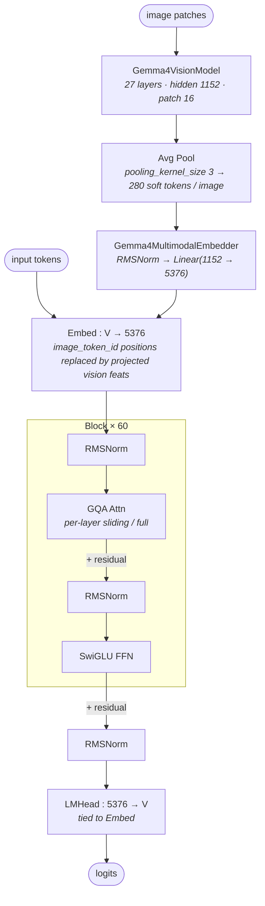

# Gemma 4 31B-it architecture (block-level)

## Model summary

| Field          | Value       |
|----------------|-------------|
| modality       | text+vision |
| attention_type | gqa         |
| ffn_type       | dense       |
| params         | 31B         |

`31B` is the model-id figure (`google/gemma-4-31B-it`). The HF model card sidebar reports `33B params` (counting the vision tower + audio token embeddings); the model-card body states `30.7B total parameters` for the text backbone with `~550M` for the vision encoder. The single-field `params` here tracks the HF id label per `authoring-policy.md` § 4a; the underlying numerical breakdown lives in `## Key parameters`.

## Modules (in forward order)

| #   | Module                       | Type            | Count                    | Detail |
|-----|------------------------------|-----------------|--------------------------|--------|
| V1  | Gemma4VisionModel (ViT)      | vision-encoder  | 1                        | —      |
| V2  | Avg-Pool (k=3)               | vision-encoder  | 1                        | —      |
| V3  | Gemma4MultimodalEmbedder     | fusion          | 1                        | —      |
| 1   | Embed (text + visual)        | embed           | 1                        | —      |
| 2   | RMSNorm                      | norm            | 60                       | —      |
| 3   | GQA Attn (sliding)           | attn            | 50                       | —      |
| 3*  | GQA Attn (full)              | attn            | 10                       | —      |
| 4   | RMSNorm                      | norm            | 60                       | —      |
| 5   | SwiGLU FFN                   | ffn-dense       | 60                       | —      |
| 6   | RMSNorm                      | norm            | 1                        | —      |
| 7   | LMHead (tied to Embed)       | head            | 1                        | —      |

V-prefixed rows run on the vision side once per image, before the LLM block loop. Position 3 alternates by layer index: rows 3 vs 3\* are the same attention block at structurally different settings (sliding-window 1024 vs full global with larger head_dim and shared K=V); see `## Notes` for the verified per-layer pattern.

## Key parameters

### Text backbone (LLM)

| Module | Param                          | Value (Gemma 4 31B-it)       |
|--------|--------------------------------|------------------------------|
| —      | n_layers                       | 60                           |
| —      | hidden                         | 5376                         |
| —      | vocab                          | 262144                       |
| GQA    | n_q_heads (all layers)         | 32                           |
| GQA    | n_kv_heads (sliding layers)    | 16                           |
| GQA    | n_kv_heads (full layers)       | 4 (num_global_key_value_heads) |
| GQA    | head_dim (sliding layers)      | 256                          |
| GQA    | head_dim (full layers)         | 512 (global_head_dim)        |
| GQA    | attention_k_eq_v (full layers) | true (K = V; v_proj omitted) |
| GQA    | sliding_window                 | 1024                         |
| FFN    | intermediate_size              | 21504                        |
| FFN    | hidden_activation              | gelu_pytorch_tanh            |
| RoPE   | rope_theta (sliding)           | 10,000                       |
| RoPE   | rope_theta (full)              | 1,000,000                    |
| RoPE   | rope_type (full)               | proportional, partial_rotary_factor 0.25 |
| —      | max_position                   | 262144                       |
| —      | rms_norm_eps                   | 1e-6                         |
| —      | final_logit_softcapping        | 30.0                         |
| —      | tie_word_embeddings            | true                         |

### Vision encoder (Gemma4VisionModel)

| Param                   | Value             |
|-------------------------|-------------------|
| num_hidden_layers       | 27                |
| hidden_size             | 1152              |
| num_attention_heads     | 16                |
| num_key_value_heads     | 16                |
| head_dim                | 72                |
| intermediate_size       | 4304              |
| patch_size              | 16                |
| pooling_kernel_size     | 3                 |
| position_embedding_size | 10240             |
| max_position            | 131072            |
| hidden_activation       | gelu_pytorch_tanh |
| rope_theta              | 100               |
| rms_norm_eps            | 1e-6              |

### Fusion (Gemma4MultimodalEmbedder)

| Param                          | Value                                     |
|--------------------------------|-------------------------------------------|
| pre-projection norm            | Gemma4RMSNorm(1152, with_scale=false)     |
| projection                     | Linear(1152 → 5376), bias=false           |
| vision_soft_tokens_per_image   | 280                                       |
| token-splice positions         | `image_token_id=258880` in `inputs_embeds` |

### Vision / multimodal-related token ids

| Token                | id     |
|----------------------|--------|
| image_token_id       | 258880 |
| boi_token_id         | 255999 |
| eoi_token_id         | 258882 |
| audio_token_id       | 258881 |
| boa_token_id         | 256000 |
| eoa_token_id         | 258883 |
| video_token_id       | 258884 |

`audio_token_id`, `boa_token_id`, `eoa_token_id`, `video_token_id` are reserved in the tokenizer but **not** consumed by this checkpoint — `audio_config` is `null` and there is no audio tower. Listed here for completeness; the model is `modality=text+vision` only.

## Notes

- **Hybrid sliding / full attention** (a "boundary rule, not topology" per `authoring-policy.md` § 3 — encoded here, not as a separate diagram). `text_config.layer_types` is a length-60 list following the verified pattern `[sliding × 5, full] × 10`, placing **`full_attention` at layer indices 5, 11, 17, 23, 29, 35, 41, 47, 53, 59** (10 full layers) and **`sliding_attention` everywhere else** (50 sliding layers, window 1024). The final layer (59) is `full_attention`, consistent with the model card's "the final layer is always global" claim. KV-cache footprint at long context is dominated by the 10 full-attention layers; the 50 sliding layers cap KV per token at the last 1024 positions.
- **Per-flavor GQA shape**: the **sliding** layers use GQA 32 q / 16 kv at `head_dim=256` (attention output width 32 × 256 = 8192); the **full** layers use GQA 32 q / 4 kv at `head_dim=512` (attention output width 32 × 512 = 16384) with `attention_k_eq_v=true` so K and V share a single projection (no separate `v_proj`). Both flavors are GQA — only the per-flavor scalars differ — so the model-level `attention_type=gqa` tag holds without needing a hybrid tag.
- **Per-flavor RoPE**: sliding layers use `rope_type=default` with `rope_theta=10,000` (short-range); full layers use `rope_type=proportional` with `partial_rotary_factor=0.25` and `rope_theta=1,000,000` (long-range). Only 25 % of `global_head_dim=512` (i.e. 128 dims) is rotated on the full layers; the remaining 75 % is passed through un-rotated, encoded directly in `Gemma4TextRotaryEmbedding`.
- **Fusion mechanism is a simple single-stage embedder, NOT DeepStack.** Verified in `modeling_gemma4.py::Gemma4MultimodalEmbedder.forward`:
  1. `Gemma4VisionModel` runs the full 27-layer ViT and produces a `last_hidden_state` (per-patch features at hidden=1152).
  2. `Gemma4VisionPooler` applies average pooling at `pooling_kernel_size=3` (3×3 spatial neighbourhoods), shrinking the sequence to `vision_soft_tokens_per_image=280` tokens per image.
  3. `Gemma4MultimodalEmbedder`: `Gemma4RMSNorm(1152, with_scale=false) → Linear(1152 → 5376, bias=false)` projects each pooled token to LLM hidden width.
  4. Projected features replace `image_token_id=258880` positions in `inputs_embeds` (`get_placeholder_mask` builds the boolean mask; the LLM then runs its normal forward over the combined text + visual sequence).
  This is the LLaVA-style projector-replace pattern, single-stage. No intermediate ViT-layer taps, no in-LLM injection at later layers — therefore `[[deepstack]]` is **not** referenced. The MoE-disabled dense backbone plus single-stage fusion keeps this model squarely on `ffn_type=dense` + `modality=text+vision`.
- **Tied LMHead**: `tie_word_embeddings=true` (HF declares `_tied_weights_keys = {"lm_head.weight": "model.embed_tokens.weight"}` in `Gemma4ForCausalLM`). Output projection re-uses the input embedding matrix — distinct from the Qwen3-VL-32B and Qwen3-32B dense references, both of which have `tie_word_embeddings=false`.
- **`final_logit_softcapping=30.0`** is applied to the LMHead output (a Gemma-family stability trick: `logits = tanh(logits / 30) × 30`). Not part of the graph at module level but worth noting for any kernel writer fusing the LM head.
- **MoE code path exists but is OFF**: `modeling_gemma4.py` defines `Gemma4TextExperts` and `enable_moe_block` is checked inside `Gemma4TextDecoderLayer.forward`. For this 31B-it config, `text_config.enable_moe_block=false`, `text_config.num_experts=null`, `text_config.top_k_experts=null`, `text_config.expert_intermediate_size=null`. Dense classification stands. The sibling Gemma 4 26B-A4B (MoE) flips these on; do **not** assume scalar parity across the two variants — both must be authored against their own config.
- **`max_position=262144`** (256K tokens) on the text side is the stock long-context size. Vision side uses `max_position=131072` (per-image position budget). Deployment-time YARN-style extension is out of scope.
- **Audio reserved but absent**: top-level `audio_config=null` and the modeling code's audio embedder is unused on this checkpoint. The tokenizer reserves audio token ids (258881, 256000, 258883), but the forward pass cannot consume them without an audio tower. Future Gemma 4 omni-modal checkpoints (if any) would re-author with `modality=text+vision+audio`; this 31B-it is `text+vision`.

## Source basis

No reference image: the sibling `model-architecture-diagram` skill does not currently index a Gemma 4 architecture image; the topology shown here is the standard pre-norm transformer pattern (RMSNorm → GQA → +res → RMSNorm → SwiGLU → +res) with a LLaVA-style single-stage visual projector, confirmed by the `Gemma4ForConditionalGeneration` class and `Gemma4MultimodalEmbedder.forward` in HF transformers.

Numerical fields verified against `google/gemma-4-31B-it/config.json` on 2026-05-16 (top-level `architectures=Gemma4ForConditionalGeneration`, `model_type=gemma4`; nested `text_config.model_type=gemma4_text`, `text_config.num_hidden_layers=60`, `text_config.hidden_size=5376`, `text_config.intermediate_size=21504`, `text_config.num_attention_heads=32`, `text_config.num_key_value_heads=16`, `text_config.num_global_key_value_heads=4`, `text_config.head_dim=256`, `text_config.global_head_dim=512`, `text_config.sliding_window=1024`, `text_config.enable_moe_block=false`, `text_config.num_experts=null`, `text_config.tie_word_embeddings=true`, `text_config.final_logit_softcapping=30.0`; nested `vision_config.model_type=gemma4_vision`, `vision_config.num_hidden_layers=27`, `vision_config.hidden_size=1152`, `vision_config.patch_size=16`, `vision_config.pooling_kernel_size=3`; top-level `vision_soft_tokens_per_image=280`, `image_token_id=258880`).

Fusion mechanism and per-layer sliding/full attention dispatch verified against `huggingface/transformers` reference modeling code at `src/transformers/models/gemma4/modeling_gemma4.py` on 2026-05-16: `Gemma4MultimodalEmbedder` (RMSNorm + single Linear, applied once after vision pooling), `Gemma4TextDecoderLayer.forward` consuming `self.config.layer_types[i]` to dispatch to either `create_causal_mask` or `create_sliding_window_causal_mask` and to pick between `(head_dim, num_key_value_heads)` and `(global_head_dim, num_global_key_value_heads)`, and `Gemma4TextRotaryEmbedding` selecting `proportional` RoPE with `partial_rotary_factor=0.25` for `full_attention` layers vs default RoPE for `sliding_attention` layers.

Model-card figures (33B params sidebar / 30.7B body / ~550M vision) and the architectural claim "interleaves local sliding window attention with full global attention, ensuring the final layer is always global" cross-checked against the `google/gemma-4-31B-it` HF model card on 2026-05-16.
