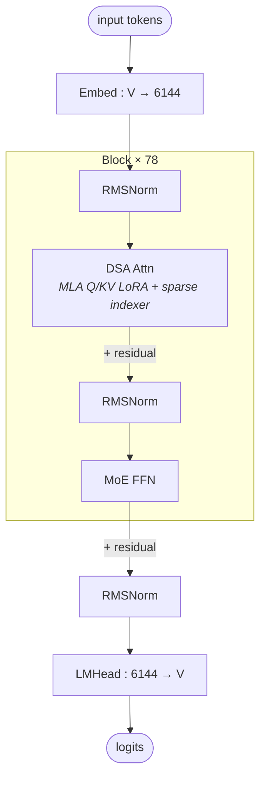

# GLM-5 architecture (block-level)

## Model summary

| Field          | Value             |
|----------------|-------------------|
| modality       | text              |
| attention_type | dsa               |
| ffn_type       | moe-shared+routed |
| params         | 744BA40B          |

## Modules (in forward order)

| #  | Module    | Type      | Count | Detail                |
|----|-----------|-----------|-------|-----------------------|
| 1  | Embed     | embed     | 1     | —                     |
| 2  | RMSNorm   | norm      | 78    | —                     |
| 3  | DSA Attn  | attn      | 78    | [[dsa]]               |
| 4  | RMSNorm   | norm      | 78    | —                     |
| 5  | MoE FFN   | ffn-moe   | 75    | [[moe-shared-routed]] |
| 5* | Dense FFN | ffn-dense | 3     | —                     |
| 6  | RMSNorm   | norm      | 1     | —                     |
| 7  | LMHead    | head      | 1     | —                     |

Position 5 alternates by layer index: `ffn-dense` for layers 1–3, `ffn-moe` for layers 4–78. The first-3-dense split is hardcoded in `GlmMoeDsaConfig.__init__` (`mlp_layer_types = ["dense"] * min(3, num_hidden_layers) + ["sparse"] * (num_hidden_layers - 3)`), not configurable via `first_k_dense_replace` (which is present in `config.json` but unread by the modeling code).

Position 3 cross-links to the shared structural module file [[dsa]]; GLM-5's `GlmMoeDsaAttention` (verified against `transformers/main` `modeling_glm_moe_dsa.py`) and DeepSeek V3.2-Exp's `MLA + Indexer` (verified against `inference/model.py`) are both consumers of that pattern.

## Key parameters

| Module | Param                | Value     |
|--------|----------------------|-----------|
| —      | n_layers             | 78        |
| —      | hidden               | 6144      |
| —      | vocab                | 154880    |
| DSA    | n_heads              | 64        |
| DSA    | num_key_value_heads  | 64        |
| DSA    | q_lora_rank          | 2048      |
| DSA    | kv_lora_rank         | 512       |
| DSA    | qk_nope_head_dim     | 192       |
| DSA    | qk_rope_head_dim     | 64        |
| DSA    | qk_head_dim          | 256       |
| DSA    | v_head_dim           | 256       |
| DSA    | head_dim             | 64        |
| DSA    | index_n_heads        | 32        |
| DSA    | index_head_dim       | 128       |
| DSA    | index_topk           | 2048      |
| MoE    | n_routed_experts     | 256       |
| MoE    | n_shared_experts     | 1         |
| MoE    | top_k                | 8         |
| MoE    | moe_intermediate     | 2048      |
| MoE    | routed_scaling_factor| 2.5       |
| MoE    | scoring_func         | sigmoid   |
| MoE    | topk_method          | noaux_tc  |
| MoE    | dense_layers         | 1–3 only  |
| Dense  | intermediate_size    | 12288     |
| —      | rope_theta           | 1,000,000 |
| —      | max_position_embeddings | 202752 |
| —      | tie_word_embeddings  | false     |

## Notes

- **`attention_type=dsa`**: GLM-5 attention is a single `GlmMoeDsaAttention` block per layer that combines two structurally inseparable pieces — (1) MLA-style low-rank Q/KV projections (`q_lora_rank=2048`, `kv_lora_rank=512`, per-head concat dim `qk_nope_head_dim + qk_rope_head_dim = 192 + 64 = 256`, separate `v_head_dim=256`), and (2) a learned **DSA indexer** (`GlmMoeDsaIndexer`) that consumes the post-LoRA Q residual plus the layer's `hidden_states`, scores all key positions with a small auxiliary projection (`index_n_heads=32`, `index_head_dim=128`), top-k selects `index_topk=2048` positions, and applies an additive `-inf` mask to the main attention scores *before* softmax. The indexer maintains its own key cache (`_cached_keys`) independent of the main KV cache. This is structurally a superset of MLA — `[[mla]]` is intentionally **not** cross-linked here: the existing `mla.md` file explicitly excludes DSA-attention models because applying its MLA-only diagram would omit the indexer.
- **Per-token compute consequence**: each token attends to at most `index_topk = 2048` selected key positions (in addition to causal masking). At sequence lengths below 2048 this collapses to standard MLA; above 2048 it reduces per-token attention FLOPs from `O(S)` to `O(2048)`. The indexer itself runs on every layer at full `O(S)` over its own (smaller) hidden width.
- **Heads are not GQA**: `num_attention_heads = num_key_value_heads = 64`. The KV-head count equals the Q-head count because, in the MLA decomposition, every "head" reconstructs its own K/V from the shared latent `c_KV`; there is no Q/KV head sharing in the sense of GQA. (`head_dim=64` in the config is unrelated to the per-head attention dim and is not used in the main attention math — the relevant per-head dims are `qk_head_dim=256` and `v_head_dim=256`.)
- **MoE**: layers 4–78 (75 layers) use `[[moe-shared-routed]]` with `n_routed_experts=256`, `n_shared_experts=1`, `top_k=8` — same numerics as DeepSeek V3. GLM-5 uses **auxiliary-loss-free balancing** (`topk_method=noaux_tc`, `scoring_func=sigmoid`, `routed_scaling_factor=2.5`) — same family as DeepSeek V3's no-aux load balancing; this is a per-model variation on the shared `moe-shared-routed` structural pattern (Hunyuan-A13B uses standard aux-loss on the same pattern). Per-token active expert count is `top_k + n_shared_experts = 9`.
- **Dense FFN at layers 1–3**: same warm-up region as DeepSeek V3 (3 dense layers, then MoE). Dense `intermediate_size = 12288 = 2× hidden`. The dense layers use `GlmMoeDsaMLP` (SiLU-activated SwiGLU-style GLU per `hidden_act=silu`); MoE layers route through `GlmMoeDsaMoE` whose individual experts are also `GlmMoeDsaMLP` instances at `moe_intermediate_size=2048`.
- **MTP is not part of the stock HF forward.** The config carries `num_nextn_predict_layers=1` but `configuration_glm_moe_dsa.py` does not read it, and `modeling_glm_moe_dsa.py` defines no MTP head class — only `GlmMoeDsaForCausalLM` with a single `lm_head`. The model card's `--speculative-config.method mtp` flag is a vLLM-side speculative-decoding hint, not a stock structural head; downstream serving agents that consume MTP weights must source them from the safetensors shards directly. Treated here as out-of-scope for the block-level diagram per § 1a (no MTP modeling code exists in the stock HF path).
- **DSA module file**: see [[dsa]] for the model-agnostic structural diagram. GLM-5's `GlmMoeDsaAttention` (verified here against `transformers/main`) and DeepSeek V3.2-Exp's `MLA + Indexer` (verified against bundled `inference/model.py`) are both confirmed instances; the `dsa.md` file captures the shared structural identity, while per-model differences (e.g. GLM-5's `indexer_topk=2048` vs V3.2-Exp's `index_topk=…`, head counts, rotation specifics) live in each model file's own `## Key parameters` and `## Notes`.
- **Stock max position 202,752** (`max_position_embeddings`) is the trained context length; effective serving context with sparse selection is deployment-policy, not structural prior.
- **Sibling GLM-5.1** (`zai-org/GLM-5.1`) is a separate published checkpoint listed at the same parameter scale (754B in the HF index card). Its architecture has not been verified against its own `config.json` in this skill — do not alias it onto this file.
- **Smaller variant `GLM-5-355B-A32B`** is mentioned in the official model card ("GLM-5 scales from 355B parameters (32B active) to 744B parameters (40B active)"), but is not published as a separate `zai-org` HF repository at time of verification — only the 744B/40B checkpoint at `zai-org/GLM-5` is fetchable.

## Source basis

No reference image — the sibling `model-architecture-diagram` skill does not currently index a GLM-5 image, so the topology shown here is synthesised from verified code.

Numerical fields verified against `zai-org/GLM-5/config.json` on 2026-05-15 (`architectures=["GlmMoeDsaForCausalLM"]`, `model_type=glm_moe_dsa`). Forward-pass topology (pre-norm residuals, `GlmMoeDsaAttention` containing both LoRA Q/KV projections and a `GlmMoeDsaIndexer` whose top-k indices mask scores before softmax, `GlmMoeDsaMoE` with shared + routed experts, first-3-layers dense via `mlp_layer_types`) verified against `huggingface/transformers` main branch `src/transformers/models/glm_moe_dsa/{configuration_glm_moe_dsa.py, modeling_glm_moe_dsa.py}` on 2026-05-15.

Total / active parameter figures (`744BA40B`) sourced from the official `zai-org/GLM-5` model card statement: *"GLM-5 scales from 355B parameters (32B active) to 744B parameters (40B active)."* The 744B/40B variant is the larger published checkpoint and matches this `zai-org/GLM-5` repository.
