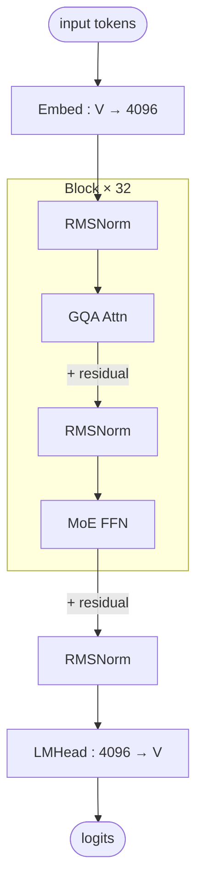

# Hunyuan-A13B architecture (block-level)

## Model summary

| Field          | Value             |
|----------------|-------------------|
| modality       | text              |
| attention_type | gqa               |
| ffn_type       | moe-shared+routed |
| params         | 80BA13B           |

## Modules (in forward order)

| # | Module    | Type    | Count | Detail                |
|---|-----------|---------|-------|-----------------------|
| 1 | Embed     | embed   | 1     | —                     |
| 2 | RMSNorm   | norm    | 32    | —                     |
| 3 | GQA Attn  | attn    | 32    | —                     |
| 4 | RMSNorm   | norm    | 32    | —                     |
| 5 | MoE FFN   | ffn-moe | 32    | [[moe-shared-routed]] |
| 6 | RMSNorm   | norm    | 1     | —                     |
| 7 | LMHead    | head    | 1     | —                     |

All 32 layers are MoE; no dense-FFN exception (unlike DeepSeek V3 family whose first 3 layers are dense).

## Key parameters

| Module | Param                | Value  |
|--------|----------------------|--------|
| —      | n_layers             | 32     |
| —      | hidden               | 4096   |
| —      | vocab                | 128167 |
| GQA    | n_q_heads            | 32     |
| GQA    | n_kv_heads           | 8      |
| GQA    | head_dim             | 128    |
| MoE    | n_routed_experts     | 64     |
| MoE    | n_shared_experts     | 1      |
| MoE    | top_k                | 8      |
| MoE    | moe_intermediate     | 3072   |
| MoE    | active_per_token     | 9 (top-8 routed + 1 shared) |

## Notes

- `ffn_type=moe-shared+routed`: every layer's FFN is a shared-expert + routed-expert combination, with the shared expert always active. The per-token activated expert count is 9 (8 routed + 1 shared), reflected in `params=80BA13B` (80B total params, 13B activated per token).
- All 32 layers use the same MoE block — there is no dense-FFN warm-up region. This is a structural difference vs DeepSeek V3 (which mixes dense FFN at layers 1–3 with MoE at layers 4–61).
- For the shared + routed combine path (router gates, expert weighting, sum into single block output) see [[moe-shared-routed]] — Hunyuan-A13B uses **standard auxiliary-loss** balancing on that shared pattern; DeepSeek V3 family uses auxiliary-loss-free.
- Cross-check: per-token total MoE FLOPs scale as 9 × per-expert FFN cost (not 65), because routed experts not in top-8 are skipped at inference.

## Source basis

Topology transcribed from self-llm `01-01-Hunyuan-A13B-architecture.jpg`
(`model-architecture-diagram` skill, entry id `hunyuan-a13b-architecture`).
Numerical fields from `tencent/Hunyuan-A13B-Instruct/config.json`
(architecture `HunYuanMoEV1ForCausalLM`, model_type `hunyuan_v1_moe`).
