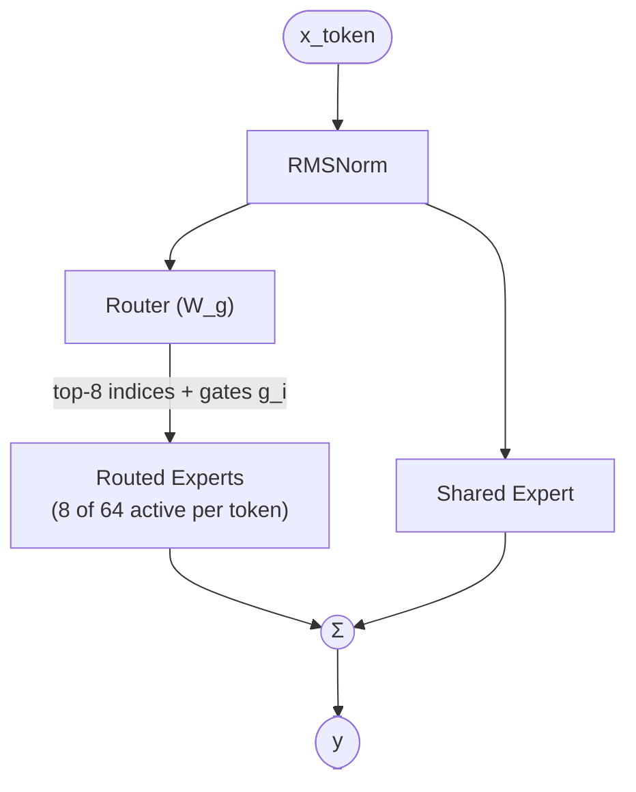

# Hunyuan-A13B MoE FFN (shared + routed)

## Key parameters

| Param                       | Value |
|-----------------------------|-------|
| n_routed_experts            | 64    |
| n_shared_experts            | 1     |
| top_k                       | 8     |
| active_experts_per_token    | 9 (top-8 routed + 1 shared) |
| moe_intermediate_size       | 3072  |
| router input dim            | 4096  |
| per-expert FFN type         | SwiGLU |

## Notes

- **Combine formula**: `y = shared(x) + Σ_{i ∈ top-k}(g_i · expert_i(x))`, where `g_i` are the softmax-normalized router scores over the selected top-8 indices. The shared expert is **always active** and contributes regardless of routing.
- **Two parallel paths from the same RMSNorm-ed input**: the router produces top-8 indices and gates that select-and-weight 8 of the 64 routed experts; the shared expert sees the same input directly. Both feed into a final sum.
- **Routed expert pool is fixed at 64**, but per-token cost scales with `top_k + n_shared_experts = 9`, not 65 — the un-selected 56 experts are skipped at inference.
- **Why shared expert exists**: it amortizes "always-needed" features across all tokens (instead of routing every token through them) and acts as a stable residual, leaving routed experts to specialize. This makes Hunyuan-A13B's MoE behave more like a dense backbone + sparse correction than a pure top-k MoE — a key kernel-planning consequence (the shared-expert path can be fused like a normal FFN, while only the routed branch needs MoE dispatch).
- This block is invoked at every one of the 32 layers. See [[hunyuan-a13b-architecture]] for block-level context.

## Source basis

Topology transcribed from self-llm `01-02-shared-and-routed-experts.png`
(`model-architecture-diagram` skill, entry id `hunyuan-a13b-shared-expert`).
Numerical fields from `tencent/Hunyuan-A13B-Instruct/config.json`.
