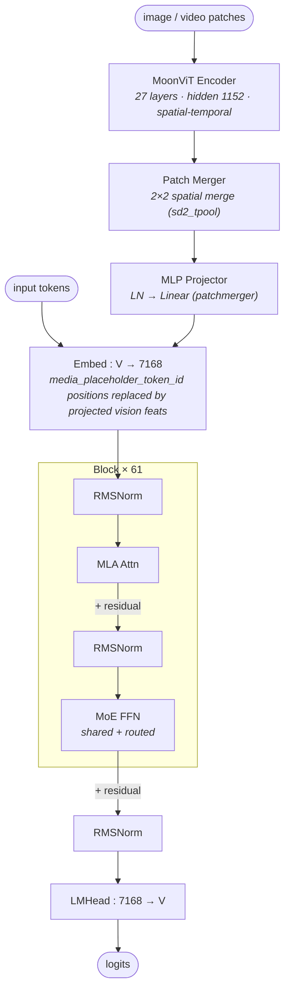

# Kimi K2.5 architecture (block-level)

## Model summary

| Field          | Value             |
|----------------|-------------------|
| modality       | text+vision       |
| attention_type | mla               |
| ffn_type       | moe-shared+routed |
| params         | 1TA32B            |

LLM backbone is 1T total / 32B activated per token (same as Kimi K2). MoonViT vision tower adds ~0.4B params on the image path; the `params` field follows the model-card headline `1T / 32B activated` figure consistent with HF naming convention.

## Modules (in forward order)

| #   | Module                | Type            | Count | Detail                |
|-----|-----------------------|-----------------|-------|-----------------------|
| V1  | MoonViT Encoder       | vision-encoder  | 1     | —                     |
| V2  | Patch Merger          | vision-encoder  | 1     | —                     |
| V3  | MLP Projector         | fusion          | 1     | —                     |
| 1   | Embed (text + visual) | embed           | 1     | —                     |
| 2   | RMSNorm               | norm            | 61    | —                     |
| 3   | MLA Attn              | attn            | 61    | [[mla]]               |
| 4   | RMSNorm               | norm            | 61    | —                     |
| 5   | MoE FFN               | ffn-moe         | 60    | [[moe-shared-routed]] |
| 5*  | Dense FFN             | ffn-dense       | 1     | —                     |
| 6   | RMSNorm               | norm            | 1     | —                     |
| 7   | LMHead                | head            | 1     | —                     |

V-prefixed rows run on the vision side before the LLM block loop. Position 5 alternates by layer index: `ffn-dense` for layer 0 (`first_k_dense_replace=1`), `ffn-moe` for layers 1–60.

## Key parameters

### Text backbone (LLM)

| Module | Param                 | Value (Kimi-K2.5)    |
|--------|-----------------------|----------------------|
| —      | n_layers              | 61                   |
| —      | hidden                | 7168                 |
| —      | vocab                 | 163840               |
| —      | intermediate_size (dense layer) | 18432      |
| MLA    | n_heads               | 64                   |
| MLA    | q_lora_rank           | 1536                 |
| MLA    | kv_lora_rank          | 512                  |
| MLA    | qk_nope_head_dim      | 128                  |
| MLA    | qk_rope_head_dim      | 64                   |
| MLA    | v_head_dim            | 128                  |
| MoE    | n_routed_experts      | 384                  |
| MoE    | n_shared_experts      | 1                    |
| MoE    | top_k                 | 8                    |
| MoE    | moe_intermediate      | 2048                 |
| MoE    | first_k_dense_replace | 1 (layer 0 dense)    |
| MoE    | topk_method           | noaux_tc             |
| MoE    | scoring_func          | sigmoid              |
| MoE    | routed_scaling_factor | 2.827                |
| —      | rope_theta            | 50000.0              |
| —      | rope_scaling (YaRN)   | factor=64, original_max_position=4096, beta_fast=32, beta_slow=1 |
| —      | max_position          | 262144 (256K)        |
| —      | tie_word_embeddings   | false                |
| —      | num_nextn_predict_layers | 0 (no MTP)        |

### Vision encoder (MoonViT, 3D variant)

| Param                  | Value     |
|------------------------|-----------|
| vt_num_hidden_layers   | 27        |
| vt_hidden_size         | 1152      |
| vt_num_attention_heads | 16        |
| vt_intermediate_size   | 4304      |
| patch_size             | 14        |
| merge_kernel_size      | [2, 2]    |
| merge_type             | sd2_tpool |
| init_pos_emb_height    | 64        |
| init_pos_emb_width     | 64        |
| init_pos_emb_time      | 4         |
| video_attn_type        | spatial_temporal |
| pos_emb_type           | divided_fixed |

### Fusion (PatchMerger MLP projector)

| Param              | Value |
|--------------------|-------|
| mm_projector_type  | patchmerger |
| mm_hidden_size     | 1152  |
| text_hidden_size   | 7168 (LLM hidden_size) |
| projector_hidden_act | gelu |
| projector_ln_eps   | 1e-05 |
| pre-norm           | LayerNorm(1152) on per-patch features |

### Vision-related token ids

| Token                       | id     |
|-----------------------------|--------|
| media_placeholder_token_id  | 163605 |
| bos_token_id                | 163584 |
| eos_token_id                | 163585 |
| pad_token_id                | 163839 |

## Notes

- **K2.5 is K2-base + vision continual pretrain.** Per the official model card, K2.5 is built by continual pretraining on ~15T mixed visual+text tokens atop Kimi-K2-Base. The LLM backbone class and topology are unchanged from Kimi K2 (see [[mla]] and [[moe-shared-routed]]); the only structural deltas are the added MoonViT vision tower + PatchMergerMLP projector on the image path, plus a context-length extension. All LLM numerical fields (`n_layers=61`, `hidden=7168`, `n_heads=64`, `q_lora_rank=1536`, `kv_lora_rank=512`, `qk_nope_head_dim=128`, `qk_rope_head_dim=64`, `v_head_dim=128`, `n_routed_experts=384`, `n_shared_experts=1`, `num_experts_per_tok=8`, `moe_intermediate_size=2048`, `intermediate_size=18432`, `first_k_dense_replace=1`, `routed_scaling_factor=2.827`, `topk_method=noaux_tc`, `scoring_func=sigmoid`, `vocab_size=163840`) match Kimi K2's config exactly.
- **Diffs vs Kimi K2** (verified field-by-field from `config.json`):
  1. **Modality**: text-only → text+vision. Top-level `architectures=["KimiK25ForConditionalGeneration"]`, `model_type=kimi_k25`; the LLM backbone lives inside `text_config` (still `DeepseekV3ForCausalLM`, `model_type=kimi_k2`). A `vision_config` block is added.
  2. **Vision tower**: MoonViT (3D variant — supports image + video via `video_attn_type=spatial_temporal` and `init_pos_emb_time=4`). 27 layers, hidden 1152, 16 heads, intermediate 4304, patch 14. Identical layer count and shapes to Kimi-VL's MoonViT, but with added temporal embeddings for video.
  3. **Fusion**: `mm_projector_type=patchmerger` — `PatchMergerMLP` (verified in `modeling_kimi_k25.py`): per-patch `LayerNorm(1152) → flatten(2×2 spatial merge → 4608) → Linear → projected to text_hidden_size=7168`, then `_merge_input_ids_with_image_features` replaces `media_placeholder_token_id=163605` positions in `inputs_embeds`. No cross-attention, no DeepStack-style multi-layer taps — single-stage projection of the final ViT layer's output, same family as Kimi-VL's MLP projector.
  4. **Context length**: `max_position_embeddings` 131072 (128K) → 262144 (256K). YaRN `factor` 32 → 64; `original_max_position_embeddings=4096` unchanged.
  5. **Quantization**: stock checkpoint ships INT4 group-quantized weights (`quant_method=compressed-tensors`, `format=pack-quantized`, `num_bits=4`, `group_size=32`, `strategy=group`, `symmetric=true`); self_attn / shared_experts / dense FFN gate-up-down / lm_head / vision_tower / mm_projector are kept in higher precision per the `ignore` regex list. Kimi K2 by contrast ships FP8 (`quant_method=fp8`, e4m3 block-wise). Stock-checkpoint precision is a deployment-side concern and out of scope for downstream prior consumers; recorded as a verified fact only.
  6. **No MTP**: `num_nextn_predict_layers=0`, same as K2.
- **MLA**: full MLA forward (low-rank Q via `q_lora_rank=1536`, low-rank KV via `kv_lora_rank=512`, RoPE applied to a `qk_rope_head_dim=64` sub-dimension shared per head). See [[mla]].
- **MoE balancing**: auxiliary-loss-free balancing — `topk_method=noaux_tc`, `scoring_func=sigmoid`, `routed_scaling_factor=2.827`. Same family as DeepSeek V3 / Kimi K2; distinct from Hunyuan-A13B's standard aux-loss balancing on the same shared+routed structure. Config also carries `aux_loss_alpha=0.001` and `seq_aux=true` inherited from the upstream class; `noaux_tc` takes precedence at load-balancing time.
- **Expert grouping is trivial**: `n_group=1`, `topk_group=1` — top-8 selection runs over the full pool of 384 routed experts (no DeepSeek-V2-style expert-group restriction).
- **Vision is native-resolution + video-capable**: MoonViT-3D processes variable-aspect / variable-resolution images and short video clips with `merge_type=sd2_tpool` (spatial-downsample-2 temporal pool) and `pos_emb_type=divided_fixed`. Structurally still a single-tower ViT with a final patch merger, hence reused as a generic `vision-encoder` row rather than a new module file.
- **`use_unified_vision_chunk=true`** in the top-level config indicates a unified packing scheme for image and video chunks at inference; this is a packing/scheduling concern, not a structural one, so it is recorded here rather than in the diagram.
- **Sibling variants**: the moonshotai org page also lists `Kimi-K2.6` and earlier `Kimi-K2-Instruct` / `Kimi-K2-Base` as distinct models; K2.5 is covered by this file only. K2.6 / future revisions are not authored speculatively (per § 1a of the authoring policy).

## Source basis

No reference image in the sibling `model-architecture-diagram` skill at time of authoring, so `source_basis.image` is `null` per § 1 of `authoring-policy.md`. The block-level topology is taken from the bundled `modeling_kimi_k25.py` + reused `modeling_deepseek.py` (Kimi K2.5 declares `architectures=["KimiK25ForConditionalGeneration"]`, `model_type=kimi_k25` at top level; `text_config.architectures=["DeepseekV3ForCausalLM"]`, `text_config.model_type=kimi_k2` for the LLM backbone).

Numerical fields verified against `moonshotai/Kimi-K2.5/config.json` on 2026-05-15 (top-level `model_type=kimi_k25`; `text_config.num_hidden_layers=61`, `text_config.hidden_size=7168`, `text_config.num_attention_heads=64`, `text_config.q_lora_rank=1536`, `text_config.kv_lora_rank=512`, `text_config.n_routed_experts=384`, `text_config.n_shared_experts=1`, `text_config.num_experts_per_tok=8`, `text_config.moe_intermediate_size=2048`, `text_config.intermediate_size=18432`, `text_config.first_k_dense_replace=1`, `text_config.topk_method=noaux_tc`, `text_config.routed_scaling_factor=2.827`, `text_config.max_position_embeddings=262144`, `text_config.num_nextn_predict_layers=0`, `text_config.vocab_size=163840`; `vision_config.vt_num_hidden_layers=27`, `vision_config.vt_hidden_size=1152`, `vision_config.vt_num_attention_heads=16`, `vision_config.vt_intermediate_size=4304`, `vision_config.patch_size=14`, `vision_config.merge_kernel_size=[2,2]`, `vision_config.mm_projector_type=patchmerger`, `vision_config.video_attn_type=spatial_temporal`).

Fusion mechanism verified against bundled `modeling_kimi_k25.py` on 2026-05-15: `MoonViT3dPretrainedModel` (vision tower) → `PatchMergerMLP` (single-stage `LN → Linear → GELU → Linear`-style projector on final ViT layer's output, no intermediate-layer taps) → `_merge_input_ids_with_image_features` (replace at `media_placeholder_token_id=163605` in `inputs_embeds`) → `language_model` (`DeepseekV3ForCausalLM` reused from `modeling_deepseek.py`). Text backbone is structurally identical to Kimi K2 / DeepSeek V3 — covered by [[mla]] and [[moe-shared-routed]].

Cross-checked against the published model-card "Model Architecture" table (`moonshotai/Kimi-K2.5/README.md`, verified 2026-05-15) which states: 1T total / 32B activated, 61 layers (1 dense included), hidden 7168, 64 attention heads, 384 experts, 8 selected, 1 shared, MoE hidden 2048, vocab 160K (config: 163840), context 256K, MLA attention, SwiGLU activation, MoonViT vision encoder (400M).
