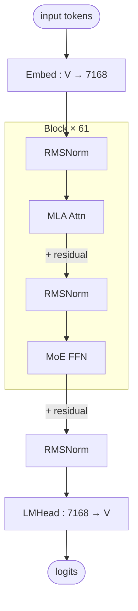

# Kimi K2 architecture (block-level)

## Model summary

| Field          | Value             |
|----------------|-------------------|
| modality       | text              |
| attention_type | mla               |
| ffn_type       | moe-shared+routed |
| params         | 1TA32B            |

## Modules (in forward order)

| #  | Module    | Type      | Count | Detail                |
|----|-----------|-----------|-------|-----------------------|
| 1  | Embed     | embed     | 1     | —                     |
| 2  | RMSNorm   | norm      | 61    | —                     |
| 3  | MLA Attn  | attn      | 61    | [[mla]]               |
| 4  | RMSNorm   | norm      | 61    | —                     |
| 5  | MoE FFN   | ffn-moe   | 60    | [[moe-shared-routed]] |
| 5* | Dense FFN | ffn-dense | 1     | —                     |
| 6  | RMSNorm   | norm      | 1     | —                     |
| 7  | LMHead    | head      | 1     | —                     |

Position 5 alternates by layer index: `ffn-dense` for layer 1 only (`first_k_dense_replace=1`), `ffn-moe` for layers 2–61.

## Key parameters

| Module | Param            | Value     |
|--------|------------------|-----------|
| —      | n_layers         | 61        |
| —      | hidden           | 7168      |
| —      | vocab            | 163840    |
| MLA    | n_heads          | 64        |
| MLA    | q_lora_rank      | 1536      |
| MLA    | kv_lora_rank     | 512       |
| MLA    | qk_nope_head_dim | 128       |
| MLA    | qk_rope_head_dim | 64        |
| MLA    | v_head_dim       | 128       |
| MoE    | n_routed_experts | 384       |
| MoE    | n_shared_experts | 1         |
| MoE    | top_k            | 8         |
| MoE    | moe_intermediate | 2048      |
| MoE    | dense_layers     | layer 1   |
| FFN    | intermediate_size (dense layer) | 18432 |

## Notes

- Kimi K2 reuses the `DeepseekV3ForCausalLM` class (config `model_type=kimi_k2`, `architectures=["DeepseekV3ForCausalLM"]`, bundled `auto_map` pointing at `modeling_deepseek.DeepseekV3ForCausalLM`), so the block-level topology is identical to DeepSeek V3 — MLA attention + shared+routed MoE FFN with one always-on shared expert in parallel with the top-k routed experts. Numerical shapes differ (see Key parameters): notably `n_heads=64` (half of DeepSeek V3's 128), `n_routed_experts=384` (vs 256), `vocab=163840` (vs 129280), and `first_k_dense_replace=1` so only the very first layer is dense.
- MLA decomposes Q/K/V via low-rank latents (`c_Q` dim 1536, `c_KV` dim 512) and applies RoPE only to a small per-head sub-dimension. See [[mla]] for the full MLA forward (shared structural pattern).
- KV cache stores `c_KV` (512) + a single shared `k_rope` (64) per layer, far smaller than caching full K/V across 64 heads.
- Router uses **auxiliary-loss-free** load balancing — `topk_method=noaux_tc` with `scoring_func=sigmoid` and `routed_scaling_factor=2.827` — a per-model variation on the shared [[moe-shared-routed]] structure. This matches the DeepSeek V3 router family; Hunyuan-A13B by contrast uses standard aux-loss balancing on the same structure. Config also sets `aux_loss_alpha=0.001` and `seq_aux=true`, kept from the upstream class but with `topk_method=noaux_tc` taking precedence at load-balancing time.
- Expert grouping is trivial: `n_group=1`, `topk_group=1`, so top-8 selection runs over the full pool of 384 routed experts (no DeepSeek-V2-style group restriction).
- No MTP heads: `num_nextn_predict_layers=0` (DeepSeek V3 sets 1 for training; Kimi K2 does not ship MTP).
- Long-context handling: `max_position_embeddings=131072` with YaRN rope scaling (`type=yarn`, `factor=32`, `original_max_position_embeddings=4096`). `rope_theta=50000.0`. Per the style guide, long-context details belong to Notes, not the diagram.
- Stock checkpoint ships FP8 weights (`quantization_config.quant_method=fp8`, block-wise 128×128, e4m3). Deployment-mode precision overlays are out of scope for this prior; recorded only as a stock-checkpoint fact.

## Source basis

No reference image is available in the sibling `model-architecture-diagram` skill at the time of authoring, so `source_basis.image` is `null` per § 1 of `authoring-policy.md`. The block-level topology is taken from the reused `DeepseekV3ForCausalLM` class (Kimi K2 bundles `modeling_deepseek.py` / `configuration_deepseek.py` and points `auto_map` at the DeepseekV3 model classes). Numerical fields verified against `moonshotai/Kimi-K2-Instruct/config.json` on 2026-05-15 (`architectures=["DeepseekV3ForCausalLM"]`, `model_type=kimi_k2`). Kimi-K2-Base reuses the same config + class and is co-listed in frontmatter aliases.
