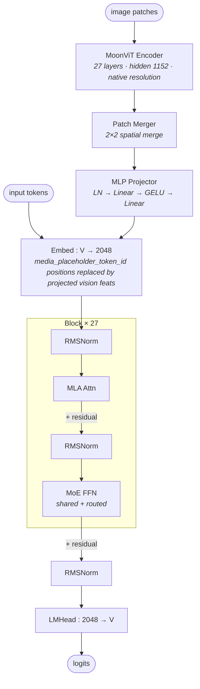

# Kimi-VL A3B architecture (block-level)

## Model summary

| Field          | Value             |
|----------------|-------------------|
| modality       | text+vision       |
| attention_type | mla               |
| ffn_type       | moe-shared+routed |
| params         | 16BA3B            |

`16BA3B` follows the model-card figures: 16B total params; ~2.8B activated LLM + ~0.4B vision tower = ~3.2B activated per text token (rounded to `A3B` in the model id `Kimi-VL-A3B-Instruct`). The 16B total includes the LLM MoE pool; the MoonViT (~0.4B) is accounted in deployment-time total but the `params` field tracks the headline `A3B`-style figure consistent with HF naming convention.

## Modules (in forward order)

| #   | Module                | Type            | Count             | Detail                |
|-----|-----------------------|-----------------|-------------------|-----------------------|
| V1  | MoonViT Encoder       | vision-encoder  | 1                 | —                     |
| V2  | Patch Merger          | vision-encoder  | 1                 | —                     |
| V3  | MLP Projector         | fusion          | 1                 | —                     |
| 1   | Embed (text + visual) | embed           | 1                 | —                     |
| 2   | RMSNorm               | norm            | 27                | —                     |
| 3   | MLA Attn              | attn            | 27                | [[mla]]               |
| 4   | RMSNorm               | norm            | 27                | —                     |
| 5   | MoE FFN               | ffn-moe         | 26                | [[moe-shared-routed]] |
| 5*  | Dense FFN             | ffn-dense       | 1                 | —                     |
| 6   | RMSNorm               | norm            | 1                 | —                     |
| 7   | LMHead                | head            | 1                 | —                     |

V-prefixed rows run on the vision side before the LLM block loop. Position 5 alternates by layer index: `ffn-dense` for layer 0 (`first_k_dense_replace=1`), `ffn-moe` for layers 1–26.

## Key parameters

### Text backbone (LLM)

| Module | Param               | Value (Kimi-VL-A3B) |
|--------|---------------------|---------------------|
| —      | n_layers            | 27                  |
| —      | hidden              | 2048                |
| —      | vocab               | 163840              |
| —      | intermediate_size   | 11264               |
| MLA    | n_heads             | 16                  |
| MLA    | q_lora_rank         | null (full-rank Q)  |
| MLA    | kv_lora_rank        | 512                 |
| MLA    | qk_nope_head_dim    | 128                 |
| MLA    | qk_rope_head_dim    | 64                  |
| MLA    | v_head_dim          | 128                 |
| MoE    | n_routed_experts    | 64                  |
| MoE    | n_shared_experts    | 2                   |
| MoE    | top_k               | 6                   |
| MoE    | moe_intermediate    | 1408                |
| MoE    | first_k_dense_replace | 1 (layer 0 dense) |
| MoE    | topk_method         | noaux_tc            |
| MoE    | scoring_func        | sigmoid             |
| MoE    | routed_scaling_factor | 2.446             |
| —      | rope_theta          | 800,000             |
| —      | max_position        | 131072              |
| —      | tie_word_embeddings | false               |

### Vision encoder (MoonViT)

| Param                  | Value |
|------------------------|-------|
| num_hidden_layers      | 27    |
| hidden_size            | 1152  |
| num_attention_heads    | 16    |
| intermediate_size      | 4304  |
| patch_size             | 14    |
| merge_kernel_size      | [2, 2] |
| init_pos_emb_height    | 64    |
| init_pos_emb_width     | 64    |

### Fusion (MLP projector)

| Param              | Value |
|--------------------|-------|
| projector input    | 1152 · 2 · 2 = 4608 (post merge_kernel concat) |
| projector hidden   | 4608  |
| projector output   | 2048 (LLM hidden_size) |
| activation         | GELU  |
| pre-norm           | LayerNorm(1152) on per-patch features |

### Vision-related token ids

| Token                       | id     |
|-----------------------------|--------|
| media_placeholder_token_id  | 163605 |
| bos_token_id                | 163584 |
| eos_token_id                | 163585 |
| pad_token_id                | 163839 |

## Notes

- **Text backbone is `DeepseekV3ForCausalLM`** (Moonlight-16B-A3B base) — same MLA + shared+routed MoE class as DeepSeek V3, but with different numerical instantiation. See [[mla]] for the MLA forward pass and [[moe-shared-routed]] for the shared+routed combine path. Per-model variation from DeepSeek V3: (a) `q_lora_rank=null` → no low-rank Q compression (full-rank `q_proj` of shape `hidden → n_heads × (qk_nope_head_dim + qk_rope_head_dim)`); only K/V is latent-compressed via `kv_lora_rank=512`. The MLA detail diagram still applies — the `c_Q` / `W_DQ` / `W_UQ_*` branch collapses to a single dense Q projection in this variant.
- **MoE balancing**: `topk_method=noaux_tc` with `scoring_func=sigmoid` and `routed_scaling_factor=2.446` — auxiliary-loss-free balancing (DeepSeek-style), distinct from Hunyuan-A13B's standard aux-loss approach on the same shared+routed structure.
- **Dense-FFN exception**: only layer 0 uses dense FFN (`first_k_dense_replace=1`); layers 1–26 are MoE. The Mermaid shows the MoE path (the common case for 26/27 layers); the dense substitution at layer 0 is captured by row `5*` in the Modules table.
- **Fusion mechanism is a simple 2-layer MLP projector**, NOT DeepStack. Verified in `modeling_kimi_vl.py::KimiVLMultiModalProjector.forward`:
  1. MoonViT produces final-layer per-patch features (`hidden=1152`).
  2. `patch_merger` with `merge_kernel_size=[2, 2]` concatenates 2×2 spatial neighborhoods → per-token width `1152 × 4 = 4608`.
  3. `KimiVLMultiModalProjector`: `LayerNorm(1152) → Linear(4608, 4608) → GELU → Linear(4608, 2048)` — single-stage projection of the **final** ViT layer's output, no intermediate-layer taps.
  4. Projected features replace `media_placeholder_token_id=163605` positions in `inputs_embeds` (`inputs_embeds[input_ids == media_placeholder_token_id] = image_features`).
  This is the standard projector-replace pattern (same family as LLaVA-style fusion), so it does **not** earn its own structural module file. Critically distinct from Qwen3-VL's [[deepstack]], which taps multiple ViT layers and adds them into the first N LLM layers; Kimi-VL has neither multi-level taps nor in-LLM injection.
- **MoonViT native resolution**: the vision tower processes variable-aspect, variable-resolution image / video patches (driven by `grid_hws` in the forward) rather than a fixed 224 / 336 / 384 resize. This is captured by the `init_pos_emb_{height,width}=64` and a packed-transformer encoder pattern; structurally it is still a single-tower ViT with a final patch merger, hence reused as a generic `vision-encoder` row rather than a new module file.
- **`max_position=131072` (128K)** stock context; `rope_theta=800,000`. Long-context behavior beyond stock is deployment-side and out of scope.
- **Variants**: `Kimi-VL-A3B-Thinking` and `Kimi-VL-A3B-Instruct-Thinking` are reasoning-tuned variants sharing this architecture class (same `KimiVLForConditionalGeneration` + `DeepseekV3ForCausalLM` + `MoonVitPretrainedModel`) — covered by this file via aliases when those configs match; if a future Thinking config differs structurally, it would be a separate file.

## Source basis

Topology anchored to the official Kimi-VL model card architecture figure
(`moonshotai/Kimi-VL-A3B-Instruct/figures/arch.png` — three-component diagram:
MoonViT + MLP projector + MoE language model).

Numerical fields verified against `moonshotai/Kimi-VL-A3B-Instruct/config.json` on 2026-05-15
(`architectures=KimiVLForConditionalGeneration`, top-level `model_type=kimi_vl`;
nested `vision_config.model_type=moonvit`; `text_config.kv_lora_rank=512`,
`text_config.q_lora_rank=null`, `text_config.n_routed_experts=64`,
`text_config.n_shared_experts=2`, `text_config.num_experts_per_tok=6`,
`text_config.first_k_dense_replace=1`, `text_config.topk_method=noaux_tc`).

Fusion mechanism verified against the bundled `modeling_kimi_vl.py` on 2026-05-15:
`KimiVLMultiModalProjector` (LN → Linear → GELU → Linear, single stage),
`_merge_with_image_features` (replace at `media_placeholder_token_id`),
`MoonVitPretrainedModel.forward` (single-stage encoder + patch_merger, no
intermediate-layer feature taps). Text-backbone class is `DeepseekV3ForCausalLM`
from the same bundled modeling file (same MLA + DeepseekV3MoE structure as
DeepSeek V3 / R1; covered by [[mla]] and [[moe-shared-routed]]).
