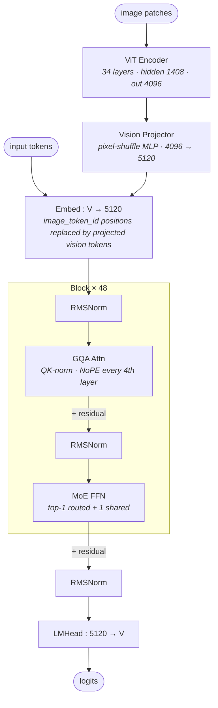

# Llama 4 Scout architecture (block-level)

## Model summary

| Field          | Value             |
|----------------|-------------------|
| modality       | text+vision       |
| attention_type | gqa               |
| ffn_type       | moe-shared+routed |
| params         | 109BA17B          |

`109BA17B` follows Meta's announced sizing: ~109B total parameters with ~17B activated per token. The activated count corresponds to attention + embedding + 1 routed expert (top-1 of 16) + 1 shared expert per layer; the routed-expert pool itself contributes most of the total parameter count.

## Modules (in forward order)

| #  | Module                 | Type            | Count            | Detail                |
|----|------------------------|-----------------|------------------|-----------------------|
| V1 | ViT Encoder            | vision-encoder  | 1                | —                     |
| V2 | Vision Projector       | fusion          | 1                | —                     |
| 1  | Embed (text + visual)  | embed           | 1                | —                     |
| 2  | RMSNorm                | norm            | 48               | —                     |
| 3  | GQA Attn               | attn            | 48               | —                     |
| 4  | RMSNorm                | norm            | 48               | —                     |
| 5  | MoE FFN                | ffn-moe         | 48               | [[moe-shared-routed]] |
| 6  | RMSNorm                | norm            | 1                | —                     |
| 7  | LMHead                 | head            | 1                | —                     |

V-prefixed rows run on the vision side before the LLM block loop begins. Every one of the 48 LLM layers is a MoE block (`moe_layers = [0..47]`, `interleave_moe_layer_step = 1`); there is no dense-FFN exception row.

## Key parameters

### Text backbone (LLM)

| Module | Param                     | Value (Scout 17B-16E)       |
|--------|---------------------------|-----------------------------|
| —      | n_layers                  | 48                          |
| —      | hidden                    | 5120                        |
| —      | vocab                     | 202048                      |
| GQA    | n_q_heads                 | 40                          |
| GQA    | n_kv_heads                | 8                           |
| GQA    | head_dim                  | 128                         |
| GQA    | use_qk_norm               | true (L2-norm on q/k when RoPE active) |
| —      | attention_chunk_size      | 8192 (chunked local attn on RoPE layers) |
| —      | no_rope_layers pattern    | [1,1,1,0] × 12 (every 4th layer is NoPE) |
| MoE    | n_routed_experts          | 16                          |
| MoE    | n_shared_experts          | 1                           |
| MoE    | top_k (num_experts_per_tok) | 1                         |
| MoE    | router activation         | sigmoid (top-k masked)      |
| MoE    | moe_intermediate (per routed expert) | 8192             |
| MoE    | shared_intermediate (intermediate_size_mlp) | 16384  |
| MoE    | active_per_token          | 2 (top-1 routed + 1 shared) |
| —      | rope_theta                | 500,000                     |
| —      | rope_scaling              | llama3, factor 16, original 8192 → 131072 |
| —      | max_position_embeddings   | 10,485,760                  |
| —      | tie_word_embeddings       | false                       |

### Vision encoder (ViT)

| Param              | Value |
|--------------------|-------|
| num_hidden_layers  | 34    |
| hidden_size        | 1408  |
| num_attention_heads| 16    |
| num_channels       | 3     |
| patch_size         | 14    |
| image_size         | 336   |
| intermediate_size  | 5632  |
| hidden_act         | gelu  |
| pixel_shuffle_ratio| 0.5   |
| vision_output_dim  | 4096  |

### Vision-related token ids

| Token             | id     |
|-------------------|--------|
| boi_token_index   | 200080 |
| eoi_token_index   | 200081 |
| image_token_index | 200092 |

## Notes

- **`ffn_type=moe-shared+routed`**: every layer's FFN is a parallel `shared_expert (Llama4TextMLP)` + routed top-1 of 16 experts. The shared expert always runs at `intermediate_size_mlp = 16384`; each routed expert runs at `intermediate_size = 8192`. Per-token active expert count is `1 + 1 = 2`, which is why `params=109BA17B` lands at the ~17B activated figure even though the total pool is 16 experts. See [[moe-shared-routed]] for the shared+routed combine graph.
- **Top-1 routing with sigmoid gating** is the Llama 4 router variation on the shared+routed pattern: `Llama4TextMoe` does `torch.topk(router_logits, top_k=1)` and applies `sigmoid` (not softmax) to the selected logit before scaling. DeepSeek V3 family uses softmax + aux-loss-free balancing; Hunyuan-A13B uses standard aux-loss softmax. This balancing variation belongs in this model's Notes, not in `moe-shared-routed.md`.
- **NoPE (no positional embedding) every 4th layer**: `no_rope_layers = [1,1,1,0] × 12` over the 48 layers — layers with value `0` skip RoPE entirely and rely on the model's other layers + attention chunking for positional information. This is a Llama 4 family design (Meta calls it "iRoPE") and is treated as a parameter variation of `gqa`, not a separate `attention_type` per § 4a.
- **Attention chunking**: RoPE layers use chunked local attention with `attention_chunk_size = 8192`; NoPE layers use full global attention. The interleave of 3 chunked-RoPE + 1 global-NoPE every 4 layers is what enables the 10M-token max position embedding without quadratic blow-up. Chunk boundary semantics are deployment-level (`## Notes` rather than topology).
- **QK-norm**: when `use_qk_norm=true` and the layer is RoPE-active, an L2-norm is applied to q and k before the attention dot product (`Llama4TextL2Norm`). NoPE layers do not apply QK-norm.
- **Vision fusion is early-fusion via token substitution**: `Llama4MultiModalProjector` (a single `nn.Linear` from `vision_output_dim=4096` to text `hidden_size=5120`) projects the ViT-adapter output, which is then placed into the LLM embedding via `inputs_embeds.masked_scatter(image_token_mask, projected_vision_flat)` at `image_token_index=200092` positions. There is no cross-attention path — vision tokens flow through the same GQA + MoE blocks as text tokens. The ViT itself uses a `Llama4VisionPixelShuffleMLP` adapter as the final stage before projection.
- **No MTP head** in the published Scout config (head-side is just LMHead).
- **Sibling models**:
  - **Llama 4 Maverick (17B-A17B-128E)**: same shared+routed top-1 MoE pattern but with `num_local_experts=128` (vs Scout's 16) and the routed `intermediate_size` typically halved to maintain activated-param parity. Same modality, same attention design. A separate file is required if/when its config is verified.
  - **Llama 4 Behemoth (288B-A288E)**: announced but not released at the time of this entry; treat as a documented gap until its `config.json` is publicly accessible.
- **Config provenance caveat**: the Meta-hosted `meta-llama/Llama-4-Scout-17B-16E-Instruct/config.json` is a gated repository (HTTP 401 without HF auth). The fields above were fetched from the public mirror `unsloth/Llama-4-Scout-17B-16E-Instruct/config.json` on 2026-05-15; mirror values cross-check against the `Llama4Config` / `Llama4TextConfig` defaults declared in the official `huggingface/transformers` source. Numbers should be re-verified against the gated original once authenticated access is available.

## Source basis

Topology anchored to the sibling `model-architecture-diagram` skill's single Llama 4 image (labelled "MoE shared expert"), refined with full config + transformers modeling code per the verified-only rule.

Numerical fields verified against `meta-llama/Llama-4-Scout-17B-16E-Instruct/config.json` on 2026-05-15 (mirror: `unsloth/Llama-4-Scout-17B-16E-Instruct/config.json`; top-level `model_type=llama4`, `architectures=["Llama4ForConditionalGeneration"]`; nested `text_config.model_type=llama4_text`; nested `vision_config.model_type=llama4_vision_model`).

Shared+routed MoE topology, sigmoid top-1 routing, NoPE-every-4th pattern, QK-norm, and early-fusion `masked_scatter` projector verified against `huggingface/transformers` `src/transformers/models/llama4/modeling_llama4.py` (classes `Llama4TextMoe`, `Llama4TextDecoderLayer`, `Llama4TextAttention`, `Llama4MultiModalProjector`, `Llama4VisionPixelShuffleMLP`) inspected 2026-05-15.
