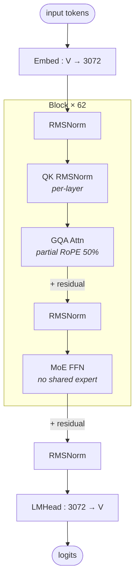

# MiniMax M2.5 architecture (block-level)

## Model summary

| Field          | Value      |
|----------------|------------|
| modality       | text       |
| attention_type | gqa        |
| ffn_type       | moe-routed |
| params         | 229BA10B   |

## Modules (in forward order)

| # | Module     | Type    | Count | Detail |
|---|------------|---------|-------|--------|
| 1 | Embed      | embed   | 1     | —      |
| 2 | RMSNorm    | norm    | 62    | —      |
| 3 | GQA Attn   | attn    | 62    | —      |
| 4 | RMSNorm    | norm    | 62    | —      |
| 5 | MoE FFN    | ffn-moe | 62    | —      |
| 6 | RMSNorm    | norm    | 1     | —      |
| 7 | LMHead     | head    | 1     | —      |

All 62 layers are structurally identical (`attn_type_list = [1] × 62`, uniform full attention; no dense-FFN fallback layer). The MoE block has no shared-expert branch — every token goes through top-8 of 256 routed experts and that result alone is summed back to the residual. Per-layer QK RMSNorm (`use_qk_norm=true`, `qk_norm_type=per_layer`) is applied to Q and K independently inside each attention block before RoPE; it is not drawn as a separate row in the table because it lives entirely inside `GQA Attn`.

## Key parameters

| Module | Param                       | Value (MiniMax-M2.5)  |
|--------|-----------------------------|-----------------------|
| —      | n_layers                    | 62                    |
| —      | hidden                      | 3072                  |
| —      | vocab                       | 200064                |
| —      | max_position_embeddings     | 196608                |
| —      | rope_theta                  | 5,000,000             |
| —      | tie_word_embeddings         | false                 |
| GQA    | n_q_heads                   | 48                    |
| GQA    | n_kv_heads                  | 8                     |
| GQA    | head_dim                    | 128                   |
| GQA    | rotary_dim                  | 64                    |
| GQA    | partial_rotary_fraction     | 0.5 (64 / 128)        |
| GQA    | use_qk_norm                 | true                  |
| GQA    | qk_norm_type                | per_layer             |
| MoE    | num_local_experts           | 256                   |
| MoE    | num_experts_per_tok (top_k) | 8                     |
| MoE    | shared_intermediate_size    | 0 (no shared expert)  |
| MoE    | intermediate_size           | 1536 (per-expert FFN) |
| MoE    | hidden_act                  | silu (SwiGLU)         |
| MoE    | scoring_func                | sigmoid               |
| MoE    | use_routing_bias            | true                  |
| MTP    | use_mtp                     | true (config flag)    |
| MTP    | num_mtp_modules             | 3                     |
| MTP    | mtp_transformer_layers      | 1                     |

## Notes

- **Diff vs MiniMax M2** (sibling-generation predecessor; M2 entry not yet authored in this skill — facts pulled from M2's own verified `config.json`, `architectures=["MiniMaxM2ForCausalLM"]`, `model_type=minimax_m2`):
  - **Same modeling class** (`MiniMaxM2ForCausalLM`) and **same `model_type` (`minimax_m2`)** — M2.5 explicitly reuses M2's code path; `auto_map` points to `modeling_minimax_m2.MiniMaxM2ForCausalLM`.
  - **All core topology scalars match exactly**: `n_layers=62`, `hidden=3072`, `n_q_heads=48`, `n_kv_heads=8`, `head_dim=128`, `rotary_dim=64`, `num_local_experts=256`, `num_experts_per_tok=8`, `intermediate_size=1536`, `vocab=200064`, `max_position_embeddings=196608`, `rope_theta=5e6`, `tie_word_embeddings=false`.
  - **MoE shape identical**: `shared_intermediate_size=0` in both, so neither model has a shared expert — both are `ffn_type=moe-routed`, not `moe-shared+routed`. Sigmoid scoring with `e_score_correction_bias` aux-loss-free balancing in both.
  - **Attention identical**: M2's `attn_type_list` is also length 62 of all 1s — uniform full softmax attention, no hybrid. Hence `attention_type=gqa` for both, not `hybrid-*`.
  - **Param label**: HF model card lists M2.5 as **229B** params, M2 model card listed it as 230B — the configs are arithmetically the same, so the 1B delta is model-card rounding / labeling, not a structural change. Active per-token params (`A10B`) carry over: `top_k=8` routed experts of width 1536 plus the GQA block, no shared expert contribution. The MoE+attn arithmetic is identical between the two; M2.5 is an RL-refined post-training of the M2 backbone (CISPO on the M2 stack per the M2.5 model card), not a new architecture.
- **Hybrid attention is NOT used** despite the presence of an `attn_type_list` field — every entry is `1` (full softmax). The same field on hypothetical interleaved-attention MiniMax variants would slot into `hybrid-{a}+{b}` per authoring-policy § 4a; here it does not. (This is the key signal that distinguished M2 / M2.5 from earlier `MiniMax-Text-01` style hybrids — if a later MiniMax model reintroduces interleaving, that model's `attention_type` tag becomes `hybrid-linear-attn+gqa` or similar.)
- **MTP is config-declared but not in the published HF modeling code**: `use_mtp=true`, `num_mtp_modules=3`, `mtp_transformer_layers=1` are present in `config.json`, but the bundled `modeling_minimax_m2.py` exposes only the standard `MiniMaxM2ForCausalLM` causal-LM head — no MTP head class is instantiated in `forward`. This mirrors DeepSeek V3, where MTP is specified for training but the public inference graph is single-token. The block diagram therefore shows only the primary LMHead; if/when a verified MTP head module appears in MiniMax's published inference code, this entry should be revisited and the head row split into `head` + `mtp` rows. Until then, MTP is a documented config-only signal, not a structural element of the forward graph in this skill.
- **Per-layer QK RMSNorm**: `use_qk_norm=true` with `qk_norm_type=per_layer` adds an RMSNorm on Q and on K (independent norms per attention layer; `q_norm` over `n_q_heads × head_dim`, `k_norm` over `n_kv_heads × head_dim`) applied **before** rotary embedding. This is a stability mechanism not present in vanilla GQA; it's drawn inside the attention pill on the diagram (`QK RMSNorm`) rather than as a separate row in the Modules table.
- **Partial RoPE 50%**: `rotary_dim=64` of `head_dim=128` is rotated; the upper 64 dims pass through unchanged. Same fraction as DeepSeek MLA's rope branch (64 of 192 there) but in GQA form. The non-rotary half acts as the content-only channel.
- **Aux-loss-free routing bias**: `use_routing_bias=true` plus `scoring_func=sigmoid` plus an `e_score_correction_bias` buffer on the gate gives a DeepSeek-V3-style aux-loss-free load-balancing scheme on top of the standard sigmoid-gated top-k. The bias buffer is non-trainable and adjusted out-of-band during training; downstream inference treats it as a static per-expert offset.
- **Top-8 of 256 with no shared expert** is structurally identical to Qwen3-MoE's MoE shape category (top-k routed, no shared) and unlike DeepSeek V3 / Hunyuan-A13B (top-k + 1 shared). Hence `[[moe-shared-routed]]` is **not** linked from row 5 — there is no shared+routed split to draw. A separate plain `top-k MoE` module diagram is explicitly "never earn detail" per § 3 of `authoring-policy.md`.
- **FP8 quantization is baked into the published checkpoint** (`quantization_config.fmt=float8_e4m3fn`, `weight_block_size=[128,128]`, `quant_method=fp8`). This is a deployment-overlay fact, not a structural one — it does not affect the diagram, and matches M2's checkpoint format.

## Source basis

Topology and counts transcribed from `MiniMaxAI/MiniMax-M2.5/config.json`
(verified 2026-05-15: `architectures=["MiniMaxM2ForCausalLM"]`, `model_type=minimax_m2`, `auto_map.AutoModelForCausalLM=modeling_minimax_m2.MiniMaxM2ForCausalLM`).
No reference image: the sibling `model-architecture-diagram` skill lists M2.5 with the same single "architecture" entry as M2, both of which describe the standard pre-norm GQA + top-k MoE topology shown here.
Forward composition (pre-norm residual, QK norm before RoPE, sigmoid-gated MoE, no shared expert, no MTP head class) confirmed against the published `modeling_minimax_m2.py` shared between M2 and M2.5.
Cross-reference: the M2 entry (when authored) will share this same topology and most parameters; the diff is essentially the post-training recipe (CISPO RL refinement per M2.5 model card), not the architecture.
