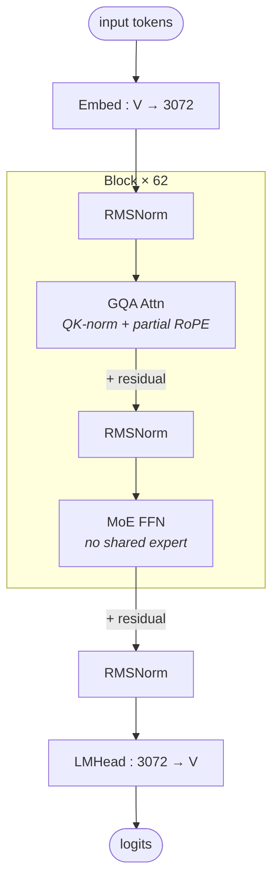

# MiniMax M2 architecture (block-level)

## Model summary

| Field          | Value      |
|----------------|------------|
| modality       | text       |
| attention_type | gqa        |
| ffn_type       | moe-routed |
| params         | 230BA10B   |

## Modules (in forward order)

| # | Module   | Type    | Count | Detail |
|---|----------|---------|-------|--------|
| 1 | Embed    | embed   | 1     | —      |
| 2 | RMSNorm  | norm    | 62    | —      |
| 3 | GQA Attn | attn    | 62    | —      |
| 4 | RMSNorm  | norm    | 62    | —      |
| 5 | MoE FFN  | ffn-moe | 62    | —      |
| 6 | RMSNorm  | norm    | 1     | —      |
| 7 | LMHead   | head    | 1     | —      |

All 62 layers are identical: standard softmax GQA attention + top-k routed MoE (no shared experts, no dense-FFN warm-up region).

## Key parameters

| Module | Param                  | Value                  |
|--------|------------------------|------------------------|
| —      | n_layers               | 62                     |
| —      | hidden                 | 3072                   |
| —      | vocab                  | 200064                 |
| —      | max_position_embeddings| 196608                 |
| —      | rope_theta             | 5,000,000              |
| —      | rotary_dim             | 64 (of head_dim 128)   |
| —      | tie_word_embeddings    | false                  |
| GQA    | n_q_heads              | 48                     |
| GQA    | n_kv_heads             | 8                      |
| GQA    | head_dim               | 128                    |
| GQA    | qk_norm                | per_layer (use_qk_norm=true) |
| MoE    | n_routed_experts       | 256                    |
| MoE    | n_shared_experts       | 0                      |
| MoE    | top_k                  | 8                      |
| MoE    | moe_intermediate_size  | 1536                   |
| MoE    | scoring_func           | sigmoid                |
| MoE    | use_routing_bias       | true                   |
| MoE    | router_aux_loss_coef   | 0.001                  |

## Notes

- **No shared experts**: `shared_intermediate_size=0` in config and the modeling file's `MiniMaxM2SparseMoeBlock` instantiates only `MiniMaxM2Experts` plus a gate — there is no parallel always-on path. This earns `ffn_type=moe-routed` (not `moe-shared+routed`), so no `[[moe-shared-routed]]` cross-link applies. The per-token active expert count is exactly `top_k=8`; activated params reflect `230BA10B`.
- **Sigmoid routing with bias correction**: `scoring_func=sigmoid`, `use_routing_bias=true`. Modeling code uses `sigmoid(router_logits) + e_score_correction_bias` to pick top-k, then renormalizes gates by their sum. This is a DeepSeek-style aux-loss-free signature on the router *plus* a standard `load_balancing_loss_func` (Switch-Transformer auxiliary loss scaled by `router_aux_loss_coef=0.001`) — both balancing mechanisms coexist. Per § 3, this is "non-trivial router" territory by name, but the per-token compute graph is still `Router → top-k → expert → weighted sum`, so it does not earn a separate detail diagram in this skill (consistent with how DeepSeek's noaux_tc balancer is described in `deepseek-v3-architecture` Notes rather than as a separate module file).
- **Uniform attention across all 62 layers**: `attn_type_list = [1, 1, …, 1]` (length 62). All layers run the same `MiniMaxM2Attention` class (standard softmax + GQA + `repeat_kv`). There is **no MiniMax-M1-style lightning-attention / softmax hybrid** here — `attention_type=gqa` is the correct closed-vocab tag, and no `hybrid-*` extension is required. The `layernorm_linear_attention_beta=1.0` field exists in config but is never read by the published modeling code; it is a legacy field from earlier MiniMax architectures.
- **Partial RoPE**: only the first `rotary_dim=64` of each head's 128 dims is rotated; the remaining 64 dims are passed through unrotated. `rope_theta=5e6` plus stock `max_position_embeddings=196608` gives a ~192K-token native context.
- **QK-norm**: `use_qk_norm=true`, `qk_norm_type=per_layer` — each layer has its own `q_norm` and `k_norm` RMSNorm modules applied after Q/K projection and before RoPE, stabilising attention logits at long context. Treated as a per-layer detail, not a structural break from GQA.
- **GQA grouping**: 48 query heads share 8 KV heads (6 queries per KV head). Per-head dim 128 → attention output width `48 × 128 = 6144` before W_O projects back to `hidden=3072`.
- **MTP configured but not in the HF modeling file**: `use_mtp=true`, `num_mtp_modules=3`, `mtp_transformer_layers=1` appear in `config.json`, but the bundled `modeling_minimax_m2.py` contains **no** MTP-head classes — `MiniMaxM2ForCausalLM` exposes only the base `model` + a single `lm_head`. MTP heads are presumed to be consumed by an external speculative-decoding stack (vLLM / SGLang draft model). Per § 1a's verified-only rule, MTP topology is **not** drawn into this block diagram and `## Modules` does not include an `mtp` row; downstream agents needing MTP structure must verify against the speculative-decoding consumer's code.
- **FP8 stock weights**: `quantization_config.quant_method=fp8`, `fmt=float8_e4m3fn`, weight block `[128, 128]`, with `gate` / `e_score_correction_bias` / `lm_head` kept in higher precision. This is the stock shipped format (i.e. the "deployment overlay" is already baked into the released checkpoint); structural diagram is unaffected.
- **Interleaved thinking model**: the model card describes M2 as an "interleaved thinking model" using `<think>…</think>` segments. This is a tokenization / prompt-format property, not a structural one, and does not appear in the forward graph.

## Source basis

Block topology transcribed from `MiniMaxM2DecoderLayer.forward` in `modeling_minimax_m2.py` (bundled via `auto_map`); structure is the standard pre-norm transformer pattern (RMSNorm → GQA → +residual → RMSNorm → MoE → +residual) with a final `MiniMaxM2RMSNorm` before `lm_head`. Numerical fields verified against `MiniMaxAI/MiniMax-M2/config.json` on 2026-05-15 (`architectures=MiniMaxM2ForCausalLM`, `model_type=minimax_m2`). Total/active param figures `230BA10B` taken from the official model card's headline claim ("230 billion total parameters with 10 billion active parameters") and are consistent with the config's `num_local_experts=256`, `num_experts_per_tok=8`, `intermediate_size=1536`, `hidden_size=3072`, `num_hidden_layers=62`.

The sibling `model-architecture-diagram` skill indexes three MiniMax M2 images (architecture / MLP / expert-routing); only the block-level architecture image was used as the topology reference here, because by § 3 the MLP and expert-routing views correspond to standard SwiGLU FFN and standard top-k MoE compute graphs that do not earn separate structural module files in this skill.
