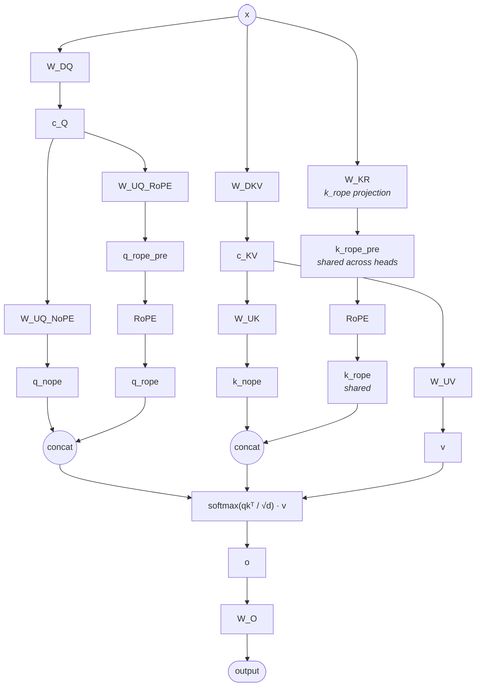

# Multi-head Latent Attention (MLA) — structural pattern

> Model-agnostic structural diagram. Verified to apply to: DeepSeek V3, DeepSeek R1 (R1 reuses V3's architecture class), Kimi K2 (reuses `DeepseekV3ForCausalLM` with `model_type=kimi_k2`), Kimi-VL-A3B-Instruct (text backbone reuses `DeepseekV3ForCausalLM`; `q_lora_rank=null` collapses the `c_Q` branch to a plain Q projection but all other branches remain). Any future model with `attention_type=mla` reuses this file provided topology matches; structurally distinct variants get a new module file with a structure-based id (e.g. `mla-<distinction>.md`), never a model-prefixed one. Numerical shapes live in each model's own `## Key parameters` table — they are not baked into this diagram.
>
> **Not covered**: DeepSeek V3.2-Exp uses DSA (DeepSeek Sparse Attention) per the official model card. The card describes DSA and MLA as **coexisting components** in V3.2 (explicit references to "RoPE in the indexer module" and "RoPE in the MLA module" as separate parts of the architecture); the exact composition order in the forward pass is not stated publicly, and V3.2 ships custom inference code rather than a standard HF `modeling_*.py`. Until V3.2's forward is verified against that code, this file does not list V3.2-Exp as a reference model — applying this MLA-only diagram to V3.2 would be incorrect because V3.2 also has a DSA indexer module that this diagram does not show.

## Key parameters (per-model values)

These are the parameter names that an MLA-using model must specify in its own `## Key parameters` table; concrete values are not part of this module file.

| Param              | Describes                                                                |
|--------------------|--------------------------------------------------------------------------|
| `q_lora_rank`      | Latent dim of `c_Q` (low-rank Q projection).                             |
| `kv_lora_rank`     | Latent dim of `c_KV` (low-rank K/V projection).                          |
| `qk_nope_head_dim` | Per-head NoPE component of Q/K (`q_nope`, `k_nope`).                     |
| `qk_rope_head_dim` | Per-head RoPE component of Q (`q_rope`) and of shared `k_rope`.          |
| `v_head_dim`       | Per-head V dim (`v`).                                                    |
| `n_heads`          | Number of attention heads (applies to NoPE and RoPE parts of Q and to K's NoPE part; `k_rope` itself is shared 1-vector). |

Effective per-head attention dim is `qk_nope_head_dim + qk_rope_head_dim`, not `qk_nope_head_dim`.

## Notes

- **The MLA trick**: instead of materializing full K/V per head, the model caches the low-rank latent `c_KV` plus a single shared `k_rope` vector. At decode time, K/V per head are reconstructed on the fly from `c_KV` (often via absorbing `W_UK` / `W_UV` into Q / O projections — "MQA absorption" mode).
- **`k_rope` is shared across all heads** (one small vector broadcast to every head). `q_rope` is per-head. This asymmetry is intentional: only Q's rotary varies by head; the rotary K is amortized.
- **Per-head attention dim is `qk_nope_head_dim + qk_rope_head_dim` (concat)**, not just `qk_nope_head_dim`. Kernel writers must plan for the concatenated dim.
- **Output projection `W_O`** consumes `(n_heads × v_head_dim)` and projects back to model `hidden`.
- Variant note: MLA has two well-known compute modes for the same structural diagram — MHA absorption (training / prefill) materializes per-head K/V from `c_KV`; MQA absorption (decode) absorbs `W_UK` into Q to avoid materialization. Both modes share this diagram; per-model Notes may pick one.

## Source basis

Topology transcribed from the InfraTech MLA-MHA diagram
(`model-architecture-diagram` skill, entry id `deepseek-v3-mla-mha`),
with the K-rope branch made explicit (the original image keeps it implicit).
Cross-references to per-model files (`deepseek-v3.2-architecture`, etc.) carry the concrete shape values.
