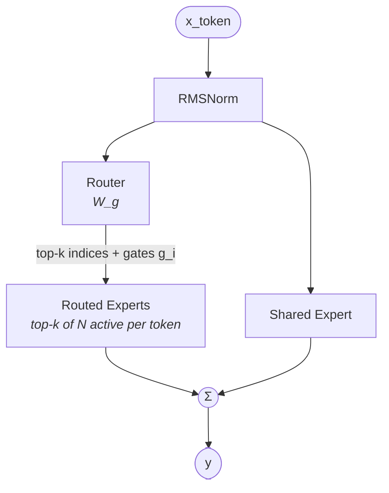

# Shared + Routed MoE FFN — structural pattern

> Model-agnostic structural diagram. Verified to apply to: DeepSeek V3, DeepSeek R1, DeepSeek V3.2-Exp, DeepSeek V4 (Pro + Flash), GLM-5, Hunyuan-A13B-Instruct, Kimi K2 (reuses `DeepseekV3ForCausalLM` with `model_type=kimi_k2`), Kimi K2.5 (text backbone reuses `DeepseekV3ForCausalLM` inside the `KimiK25ForConditionalGeneration` wrapper), Kimi-VL-A3B-Instruct (text backbone), Llama 4 Scout, Qwen3.5 MoE, Step 3.5 Flash (MoE layers 3–44). Any future model with `ffn_type=moe-shared+routed` reuses this file provided the topology matches; per-model variation (e.g. router balancing strategy, router activation function) goes in the model's own Notes. Per-model numerical values (top-k, n_routed, n_shared, per-expert intermediate dim) live in each model's own `## Key parameters` table.

## Key parameters (per-model values)

| Param                     | Describes                                                       |
|---------------------------|-----------------------------------------------------------------|
| `n_routed_experts`        | Total number of routed experts in the pool (`N`).               |
| `n_shared_experts`        | Number of shared experts (always-on; usually 1).                |
| `top_k`                   | How many routed experts are selected per token.                 |
| `moe_intermediate_size`   | Per-expert FFN intermediate dim (each routed expert and the shared expert share this width, unless noted otherwise per model). |
| `router input dim`        | Equals model `hidden`; the router consumes the post-RMSNorm activation. |

Per-token active expert count is `top_k + n_shared_experts`, not `n_routed_experts + n_shared_experts`. This drives the activated-params figure (`xxBAxxB`) in each model's Model summary.

## Notes

- **Combine formula**: `y = Σ_{e ∈ shared} expert_e(x)  +  Σ_{i ∈ top-k}(g_i · routed_i(x))`. Shared experts always contribute; routed experts only when selected.
- **Two parallel paths from the same RMSNorm-ed input**: the router produces top-k indices + softmax-normalized gates that select-and-weight `top_k` of the `n_routed_experts`; the shared expert(s) see the same input directly. Both feed into a final sum.
- **Why a shared expert exists**: it amortizes always-needed features across all tokens (rather than routing every token through them) and acts as a stable backbone, leaving routed experts to specialize. This makes the FFN behave more like a dense backbone + sparse correction than a pure top-k MoE — a key kernel-planning consequence: the shared path can be fused like a normal FFN, while only the routed branch needs MoE dispatch.
- **Per-model variation** is in how the router is trained / balanced and which gating nonlinearity it uses, not in this diagram:
  - DeepSeek V3 / R1 / V3.2-Exp: `scoring_func=sigmoid` with auxiliary-loss-free load balancing (`topk_method=noaux_tc`, bias-only adjustment per expert).
  - DeepSeek V4: `sqrtsoftplus` gating activation with auxiliary-loss-free balancing; first 3 MoE layers use hash-based routing instead of learned router.
  - GLM-5: sigmoid gating with auxiliary-loss-free balancing (`topk_method=noaux_tc`).
  - Kimi K2 / K2.5: auxiliary-loss-free load balancing (`topk_method=noaux_tc`, `scoring_func=sigmoid`), same family as DeepSeek V3.
  - Hunyuan-A13B: standard auxiliary-loss balancing (per the tech report; the HF config does not expose `scoring_func` or `router_aux_loss_coef`, so the gating activation specifics are paper-based, not config-based).
  - Llama 4 (Scout / Maverick): sigmoid gating (per-expert independent gate, not softmax-normalised) with `top_k=1`; standard `router_aux_loss_coef`.
  - Qwen3.5 MoE: sigmoid gating; aux-loss-free balancing.
  - Step 3.5 Flash: sigmoid (not softmax) router activation with `moe_router_scaling_factor=3.0`, learned per-expert router bias (`use_moe_router_bias=true`), fp32 gate computation.
  - These differences belong in each model's Notes, not here.

## Source basis

Topology transcribed from the self-llm shared-and-routed-experts image
(`model-architecture-diagram` skill, entry id `hunyuan-a13b-shared-expert`).
Cross-references to per-model files carry the concrete `n_routed`, `top_k`, and balancing strategy.
