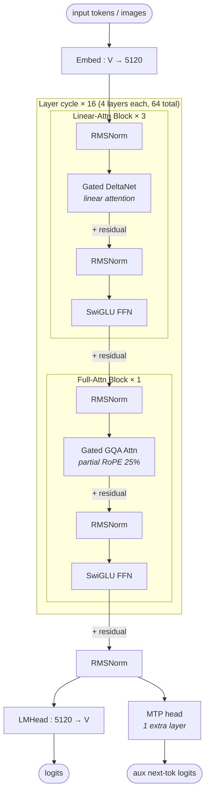

# Qwen3.5 dense architecture (block-level)

## Model summary

Values shown are for **Qwen3.5-27B**; smaller Qwen3.5 dense variants (9B / 4B / 2B / 0.8B) share the topology and tag set with different scalars.

| Field          | Value                  |
|----------------|------------------------|
| modality       | text+vision            |
| attention_type | hybrid-linear-attn+gqa |
| ffn_type       | dense                  |
| params         | 27B                    |

## Modules (in forward order)

| #  | Module           | Type      | Count | Detail |
|----|------------------|-----------|-------|--------|
| 1  | Embed            | embed     | 1     | —      |
| 2  | RMSNorm          | norm      | 64    | —      |
| 3  | Gated DeltaNet   | attn      | 48    | —      |
| 3* | Gated GQA Attn   | attn      | 16    | —      |
| 4  | RMSNorm          | norm      | 64    | —      |
| 5  | SwiGLU FFN       | ffn-dense | 64    | —      |
| 6  | RMSNorm          | norm      | 1     | —      |
| 7  | LMHead           | head      | 1     | —      |
| 8  | MTP head         | mtp       | 1     | —      |

Rows 3 and 3* alternate by position: `layer_types` is `[lin, lin, lin, full] × 16`, so every 4th layer (indices 3, 7, 11, …, 63 — 0-indexed) uses Gated GQA attention; the other 48 use linear (Gated DeltaNet) attention. The SwiGLU FFN at row 5 is identical across all 64 layers regardless of which attention path the layer uses.

Vision tower (27-layer ViT, hidden 1152, projects to text hidden 5120) feeds vision tokens into the same `Embed` token stream — out of scope for this block-level diagram; see `## Notes`.

## Key parameters

| Module        | Param                       | Value (Qwen3.5-27B) |
|---------------|-----------------------------|---------------------|
| —             | n_layers                    | 64                  |
| —             | hidden                      | 5120                |
| —             | vocab                       | 248320              |
| —             | max_position_embeddings     | 262144              |
| —             | full_attention_interval     | 4                   |
| Gated GQA     | n_q_heads                   | 24                  |
| Gated GQA     | n_kv_heads                  | 4                   |
| Gated GQA     | head_dim                    | 256                 |
| Gated GQA     | partial_rotary_factor       | 0.25                |
| Gated GQA     | attn_output_gate            | true                |
| Linear attn   | linear_num_key_heads        | 16                  |
| Linear attn   | linear_num_value_heads      | 48                  |
| Linear attn   | linear_key_head_dim         | 128                 |
| Linear attn   | linear_value_head_dim       | 128                 |
| Linear attn   | linear_conv_kernel_dim      | 4                   |
| FFN           | intermediate_size           | 17408               |
| FFN           | hidden_act                  | silu (SwiGLU)       |
| MTP           | mtp_num_hidden_layers       | 1                   |
| MTP           | mtp_use_dedicated_embeddings| false               |
| Vision (ViT)  | depth                       | 27                  |
| Vision (ViT)  | hidden_size                 | 1152                |
| Vision (ViT)  | intermediate_size           | 4304                |
| Vision (ViT)  | out_hidden_size             | 5120                |
| Vision (ViT)  | patch_size                  | 16                  |
| Vision (ViT)  | deepstack_visual_indexes    | [] (disabled)       |
| RoPE          | rope_theta                  | 10000000            |
| RoPE          | mrope_section               | [11, 11, 10]        |
| —             | tie_word_embeddings         | false               |

## Notes

- **Diff vs Qwen3-32B (sibling-generation predecessor, see [[qwen3-dense-architecture]])**:
  - `hidden`: 5120 (same); `n_layers`: 64 (same); `intermediate_size`: 25600 → **17408** (FFN narrowed ~32%).
  - `attention_type`: pure `gqa` (Q=64, KV=8, head_dim=128) → **`hybrid-linear-attn+gqa`** (Gated DeltaNet 3:1 with Gated GQA Q=24, KV=4, head_dim=256). KV-cache footprint is dominated by the 16 full-attention layers, not all 64; the 48 linear layers carry a recurrent state instead of a per-token KV cache.
  - `head_dim`: 128 → **256** for full attention; full attention uses **partial RoPE** (25% of head_dim rotated, i.e. 64 of 256) instead of full-head RoPE; and adds an `attn_output_gate` sigmoid on the attention output.
  - `vocab`: 151936 → **248320** (~63% larger; padded multimodal-aware tokenizer).
  - `max_position_embeddings`: 40960 → **262144** (~6.4×); `rope_theta`: 1e6 → **1e7**.
  - **Modality**: text-only → **text+vision** (27-layer ViT, hidden 1152, projects into the LLM token stream at hidden=5120). Qwen3-32B has no vision tower.
  - **MTP**: added — 1 extra prediction layer alongside `LMHead`.
- **Hybrid attention layout**: `layer_types` in the verified config is a length-64 list of `["linear_attention"×3, "full_attention"×1] × 16`. `full_attention_interval=4` confirms the period. There is no per-block parallel hybrid (linear and full are never run on the same token at the same layer); the hybridization is across-layer interleaving — identical scheduling to the Qwen3.5-MoE sibling [[qwen3-5-moe-architecture]], only the FFN flavor differs.
- **Gated DeltaNet** (linear attention) replaces softmax attention with a kernel-feature-map mechanism; 16 K-heads + 48 V-heads with `head_dim=128`, plus a 4-tap depthwise conv (`linear_conv_kernel_dim=4`) on the input stream. KV-cache is replaced by a recurrent state in these layers, so prefill / decode KV-cache budgeting must distinguish the two layer kinds.
- **Gated attention (full)**: standard softmax attention with `attn_output_gate=true` (sigmoid gate on the attention output) and partial RoPE (only the first `0.25 × head_dim = 64` dims rotated). MRoPE is interleaved with section sizes `[11, 11, 10]` (time / height / width for multimodal positions).
- **FFN is dense at every layer**: `mlp_only_layers=[]` and there is no MoE config — every one of the 64 layers carries a single SwiGLU FFN (`intermediate_size=17408`). This is the structural axis that separates this entry from [[qwen3-5-moe-architecture]] (which uses `moe-shared+routed` at the same 60 hybrid-attention layer positions). All other axes (hybrid attention, MTP, vision tower) match the MoE sibling.
- **No tied embeddings**: `tie_word_embeddings=false` — Embed and LMHead are separate weight matrices (matches Qwen3.5-9B/27B/MoE; the 2B and 0.8B variants tie them per their own configs).
- **Vision path**: stock-like 27-layer ViT (patch=16, hidden=1152) with `out_hidden_size=5120` projecting visual features to the LLM hidden dim. `deepstack_visual_indexes=[]` — DeepStack multi-level injection is **not** used in this config (contrast with Qwen3-VL where it is; see [[deepstack]]). Vision tokens enter via standard token-stream concatenation around `image_token_id=248056` / `video_token_id=248057`. A dedicated VLM fusion detail diagram is omitted per the skill's 3-diagram cap.
- **Hybrid-attention module file is a deferred gap**: per authoring-policy § 3 a hybrid-attention module would auto-earn a detail diagram, but no shared module file (`hybrid-deltanet-gated-gqa.md` or similar) yet exists. The hybrid layout is fully spelled out in this block-level diagram; if a per-attention-flavor forward graph is needed, author the module file and link from row 3 / 3* of `## Modules`. The same gap applies to [[qwen3-5-moe-architecture]].
- `params=27B`: matches the verified Qwen3.5-27B model card; total parameter count is dominated by the 64 dense SwiGLU FFNs plus the 16 full-attention KV-cache-bearing layers; the 27-layer ViT contributes a small fraction.

## Source basis

Topology and counts transcribed from `Qwen/Qwen3.5-27B/config.json`
(verified 2026-05-15: `architectures=["Qwen3_5ForConditionalGeneration"]`, `model_type=qwen3_5`).
Sibling-skill image entry (`model-architecture-diagram :: qwen3-5-27b-dense-architecture`) provides the abstraction-level reference; numerical fields here come exclusively from the config. Cross-link to [[qwen3-dense-architecture]] (Qwen3 generation predecessor, pure GQA + text-only + no MTP) and [[qwen3-5-moe-architecture]] (same hybrid attention + MTP + vision, but `moe-shared+routed` FFN instead of dense).
