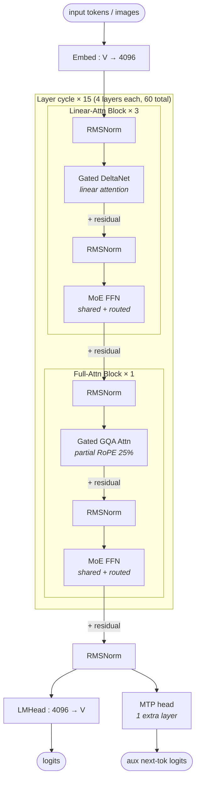

# Qwen3.5 MoE architecture (block-level)

## Model summary

| Field          | Value                    |
|----------------|--------------------------|
| modality       | text+vision              |
| attention_type | hybrid-linear-attn+gqa   |
| ffn_type       | moe-shared+routed        |
| params         | 397BA17B                 |

## Modules (in forward order)

| #  | Module           | Type    | Count | Detail                |
|----|------------------|---------|-------|-----------------------|
| 1  | Embed            | embed   | 1     | —                     |
| 2  | RMSNorm          | norm    | 60    | —                     |
| 3  | Gated DeltaNet   | attn    | 45    | —                     |
| 3* | Gated GQA Attn   | attn    | 15    | —                     |
| 4  | RMSNorm          | norm    | 60    | —                     |
| 5  | MoE FFN          | ffn-moe | 60    | [[moe-shared-routed]] |
| 6  | RMSNorm          | norm    | 1     | —                     |
| 7  | LMHead           | head    | 1     | —                     |
| 8  | MTP head         | mtp     | 1     | —                     |

Rows 3 and 3* alternate by position: `layer_types` is `[lin, lin, lin, full] × 15`, so every 4th layer (indices 3, 7, 11, …, 59 — 0-indexed) uses Gated GQA attention; the other 45 use linear (Gated DeltaNet) attention. The MoE FFN at row 5 is identical across all 60 layers regardless of which attention path the layer uses.

Vision tower (27-layer ViT, hidden 1152, projects to text hidden 4096) feeds vision tokens into the same `Embed` token stream — out of scope for this block-level diagram; see `## Notes`.

## Key parameters

| Module        | Param                            | Value    |
|---------------|----------------------------------|----------|
| —             | n_layers                         | 60       |
| —             | hidden                           | 4096     |
| —             | vocab                            | 248320   |
| —             | max_position_embeddings          | 262144   |
| —             | full_attention_interval          | 4        |
| Gated GQA     | n_q_heads                        | 32       |
| Gated GQA     | n_kv_heads                       | 2        |
| Gated GQA     | head_dim                         | 256      |
| Gated GQA     | partial_rotary_factor            | 0.25     |
| Linear attn   | linear_num_key_heads             | 16       |
| Linear attn   | linear_num_value_heads           | 64       |
| Linear attn   | linear_key_head_dim              | 128      |
| Linear attn   | linear_value_head_dim            | 128      |
| Linear attn   | linear_conv_kernel_dim           | 4        |
| MoE           | n_routed_experts                 | 512      |
| MoE           | n_shared_experts                 | 1        |
| MoE           | top_k (num_experts_per_tok)      | 10       |
| MoE           | moe_intermediate_size            | 1024     |
| MoE           | shared_expert_intermediate_size  | 1024     |
| MoE           | active_per_token                 | 11 (top-10 routed + 1 shared) |
| MTP           | mtp_num_hidden_layers            | 1        |
| Vision (ViT)  | depth                            | 27       |
| Vision (ViT)  | hidden_size                      | 1152     |
| Vision (ViT)  | intermediate_size                | 4304     |
| Vision (ViT)  | out_hidden_size                  | 4096     |
| Vision (ViT)  | patch_size                       | 16       |
| RoPE          | rope_theta                       | 10000000 |

## Notes

- **Diff vs Qwen3-235B-A22B (sibling-generation predecessor, see [[qwen3-moe-block]])**:
  - `hidden`: 4096 (same) — but layer count drops 94 → 60 and total params nearly doubles via the much wider expert pool.
  - `n_routed_experts`: 128 → **512** (4×); `top_k`: 8 → **10**.
  - `n_shared_experts`: **0 → 1** — Qwen3.5 MoE introduces a shared expert (always-on, parallel with routed branch), moving it from `ffn_type=moe-routed` to `moe-shared+routed`. Per-token active expert count is now 11.
  - `attention_type`: pure `gqa` (Q=64, KV=4) → **`hybrid-linear-attn+gqa`** (Gated DeltaNet 3:1 with Gated GQA Q=32, KV=2). KV-cache footprint is dominated by the 15 full-attention layers, not all 60.
  - `head_dim`: 128 → **256** for full attention; full attention uses **partial RoPE** (25% of head_dim rotated, i.e. 64 of 256) instead of full-head RoPE.
  - **Modality**: text-only → **text+vision** (27-layer ViT projects into the LLM token stream). Qwen3-235B-A22B has no vision tower.
  - **MTP**: added — 1 extra prediction layer alongside `LMHead`.
- **Hybrid attention layout**: `layer_types` in the verified config is a length-60 list of `["linear_attention"×3, "full_attention"×1] × 15`. `full_attention_interval=4` confirms the period. There is no per-block parallel hybrid (linear and full are never run on the same token at the same layer); the hybridization is across-layer interleaving.
- **Gated DeltaNet** (linear attention) replaces softmax attention with a kernel-feature-map mechanism; 16 K-heads + 64 V-heads with `head_dim=128`, plus a 4-tap depthwise conv (`linear_conv_kernel_dim=4`) on the input stream. KV-cache is replaced by a recurrent state in these layers.
- **Gated attention (full)**: standard softmax attention with `attn_output_gate=true` (sigmoid gate on the attention output) and partial RoPE (only the first `0.25 × head_dim = 64` dims rotated). MRoPE is interleaved with section sizes `[11, 11, 10]` (time / height / width for multimodal positions).
- **MoE structural pattern**: every one of the 60 layers uses the shared + routed MoE pattern from [[moe-shared-routed]] — `mlp_only_layers=[]` in the config means there is no dense-FFN warm-up region. Combine formula and per-token activated-expert math are detailed in that file.
- **Router balancing**: aux-loss-based (`router_aux_loss_coef=0.001`), unlike DeepSeek V3 family's aux-loss-free strategy; this is a per-model variation on top of `moe-shared-routed` and does not change the structural diagram.
- **Vision path**: stock-like 27-layer ViT (patch=16, hidden=1152) with `out_hidden_size=4096` projecting visual features to the LLM hidden dim. `deepstack_visual_indexes=[]` — DeepStack multi-level injection is **not** used in this config (contrast with Qwen3-VL where it is; see [[deepstack]]). Vision tokens enter via standard token-stream concatenation around `image_token_id=248056` / `video_token_id=248057`. A dedicated VLM fusion detail diagram is omitted here per the skill's 3-diagram cap; if downstream agents need it, author a separate `qwen3-5-vision.md` from the stand-alone vision config.
- `params=397BA17B`: 397B total parameters; ~17B activated per token (top-10 of 512 routed experts + 1 shared expert + the per-layer attention block — whichever flavor is active at that layer — + embed/norm/head). Matches the verified model card.

## Source basis

Topology and counts transcribed from `Qwen/Qwen3.5-397B-A17B/config.json`
(verified 2026-05-15: `architectures=["Qwen3_5MoeForConditionalGeneration"]`, `model_type=qwen3_5_moe`).
Sibling-skill image entry (`model-architecture-diagram :: qwen3-5-moe-397b-a17b-architecture`) provides the abstraction-level reference; numerical fields here come exclusively from the config. MoE structural pattern shared with [[moe-shared-routed]]; per-model router-balancing variation (aux-loss-based) noted in `## Notes`. Cross-link to [[qwen3-moe-block]] (predecessor) and [[deepstack]] (vision feature already used by Qwen3-VL but not enabled here).
