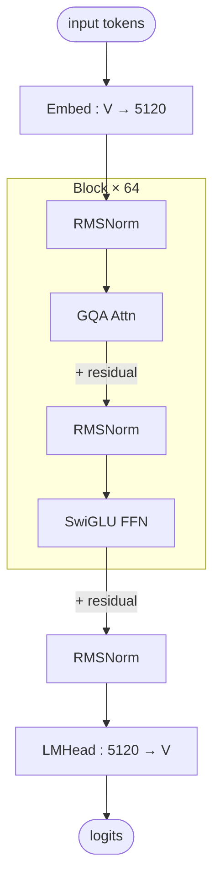

# Qwen3 dense architecture (block-level)

## Model summary

Values shown are for **Qwen3-32B**; smaller Qwen3 dense variants share the topology and tag set with different scalars.

| Field          | Value |
|----------------|-------|
| modality       | text  |
| attention_type | gqa   |
| ffn_type       | dense |
| params         | 32B   |

## Modules (in forward order)

| # | Module      | Type      | Count | Detail |
|---|-------------|-----------|-------|--------|
| 1 | Embed       | embed     | 1     | —      |
| 2 | RMSNorm     | norm      | 64    | —      |
| 3 | GQA Attn    | attn      | 64    | —      |
| 4 | RMSNorm     | norm      | 64    | —      |
| 5 | SwiGLU FFN  | ffn-dense | 64    | —      |
| 6 | RMSNorm     | norm      | 1     | —      |
| 7 | LMHead      | head      | 1     | —      |

All 64 layers are identical (no MoE, no dense-MoE alternation). Standard pre-norm transformer.

## Key parameters

| Module | Param             | Value (Qwen3-32B) |
|--------|-------------------|-------------------|
| —      | n_layers          | 64                |
| —      | hidden            | 5120              |
| —      | vocab             | 151936            |
| GQA    | n_q_heads         | 64                |
| GQA    | n_kv_heads        | 8                 |
| GQA    | head_dim          | 128               |
| FFN    | intermediate_size | 25600             |
| —      | rope_theta        | 1,000,000         |
| —      | tie_word_embeddings | false           |

## Notes

- **GQA**: 64 query heads share 8 KV heads (8 queries per KV head), reducing KV-cache footprint to 1/8 of vanilla MHA. Per-head dim is 128 for both Q and K/V; total attention output width is `64 × 128 = 8192` before W_O projects back to `hidden=5120`.
- **No sliding window**: `sliding_window=null` and `use_sliding_window=false` in config — full quadratic attention at every layer.
- **No tied embeddings**: `tie_word_embeddings=false` — Embed and LMHead are separate weight matrices.
- **Large RoPE base** (`rope_theta=1e6`) indicates long-context training; pair with the stock `max_position_embeddings=40960` (≈ 40K tokens). YARN-style extension is deployment-time, not in stock config.
- **Sibling MoE variants** (Qwen3-235B-A22B, Qwen3-30B-A3B) are described in [[qwen3-moe-block]]. Both families share `attention_type=gqa` and `modality=text` but differ on `ffn_type` and `architectures` class (`Qwen3ForCausalLM` vs `Qwen3MoeForCausalLM`).

## Source basis

No reference image: the sibling `model-architecture-diagram` skill does not currently index a Qwen3-dense architecture image; the topology shown here is the standard pre-norm transformer pattern (RMSNorm → GQA → +res → RMSNorm → SwiGLU → +res) confirmed by the Qwen3 `Qwen3ForCausalLM` architecture class.

Numerical fields verified against `Qwen/Qwen3-32B/config.json` on 2026-05-14 (`architectures=Qwen3ForCausalLM`, `model_type=qwen3`).
