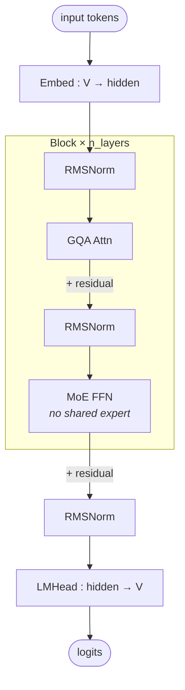

# Qwen3 MoE block

## Key parameters

Values shown are for **Qwen3-235B-A22B**; the smaller `Qwen3-30B-A3B` MoE shares the same topology with different numbers.

| Module | Param            | Value (235B-A22B) |
|--------|------------------|-------------------|
| —      | n_layers         | 94                |
| —      | hidden           | 4096              |
| —      | vocab            | 151936            |
| GQA    | n_q_heads        | 64                |
| GQA    | n_kv_heads       | 4                 |
| GQA    | head_dim         | 128               |
| MoE    | n_routed_experts | 128               |
| MoE    | n_shared_experts | 0                 |
| MoE    | top_k            | 8                 |
| MoE    | moe_intermediate | 1536              |

## Notes

- **No shared expert.** This is the key MoE-flavor difference vs DeepSeek-V3.2 (see [[deepseek-v3.2-architecture]]), which keeps 1 shared expert always-on plus the top-k routed ones.
- Attention is plain **GQA** (grouped-query), not MLA — KV is cached at full per-(kv-)head granularity. Memory characteristics differ substantially from the MLA family.
- Activated parameters per token ≈ 22B for the 235B variant: top-8 of 128 routed experts on each MoE layer, plus shared (non-MoE) attention / norm / embed weights.
- Numerical fields above are representative of the 235B-A22B variant. For other Qwen3 MoE sizes, the topology is identical; consult the corresponding HF config.

## Source basis

Topology transcribed from the self-llm Qwen3 architecture image
(`model-architecture-diagram` skill, entry id `qwen3-moe` / self-llm `models/Qwen3/images/01-02.png`).
Numerical fields from `Qwen/Qwen3-235B-A22B/config.json` and `modeling_qwen3_moe.py`.
