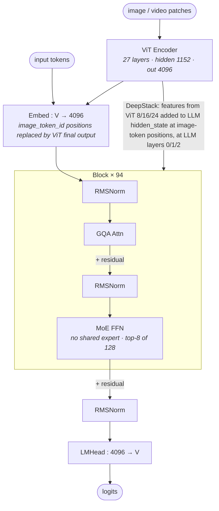

# Qwen3-VL 235B-A22B architecture (block-level)

## Model summary

| Field          | Value       |
|----------------|-------------|
| modality       | text+vision |
| attention_type | gqa         |
| ffn_type       | moe-routed  |
| params         | 235BA22B    |

`235BA22B` matches the underlying Qwen3-235B-A22B text-backbone scale (94 layers × 128 routed experts, top-8 active per token). The vision encoder (27-layer ViT, hidden=1152, intermediate=4304) adds roughly +0.4B parameters and is folded into deployment-time total counts but not included in the `params` field above — that field tracks the LLM-side scale consistent with the HF naming convention.

## Modules (in forward order)

| #   | Module                  | Type            | Count                | Detail        |
|-----|-------------------------|-----------------|----------------------|---------------|
| V1  | ViT Encoder + Merger    | vision-encoder  | 1                    | —             |
| V2  | DeepStack Mergers       | fusion          | 3 (at ViT 8/16/24)   | [[deepstack]] |
| 1   | Embed (text + visual)   | embed           | 1                    | —             |
| 2   | RMSNorm                 | norm            | 94                   | —             |
| 3   | GQA Attn                | attn            | 94                   | —             |
| 4   | RMSNorm                 | norm            | 94                   | —             |
| 5   | MoE FFN                 | ffn-moe         | 94                   | —             |
| 5d  | DeepStack inject (add)  | fusion          | 3 (at LLM 0/1/2)     | [[deepstack]] |
| 6   | RMSNorm                 | norm            | 1                    | —             |
| 7   | LMHead                  | head            | 1                    | —             |

V-prefixed rows run on the vision side **before** the LLM block loop begins; the LLM-side rows then run for every text + image token in interleaved order. Row 5d is an **in-place addition** at the image-token positions of the hidden state, applied at LLM layers 0 / 1 / 2 only — all other LLM layers (3 – 93) run without DeepStack injection.

Row 5 carries no `Detail` link: this is `ffn_type=moe-routed` (standard top-k, no shared expert), which does not auto-earn a detail diagram per `authoring-policy.md` § 3. The textbook top-k MoE behaviour (router → top-k of N experts → weighted sum) is implied by the `ffn-moe` tag alone; see [[qwen3-moe-block]] for the same block in the text-only Qwen3-MoE sibling.

## Key parameters

### Text backbone (LLM, MoE)

| Module | Param                | Value (Qwen3-VL-235B-A22B)            |
|--------|----------------------|---------------------------------------|
| —      | n_layers             | 94                                    |
| —      | hidden               | 4096                                  |
| —      | vocab                | 151936                                |
| GQA    | n_q_heads            | 64                                    |
| GQA    | n_kv_heads           | 4                                     |
| GQA    | head_dim             | 128                                   |
| FFN    | intermediate_size    | 12288 (dense-FFN fallback; see Notes) |
| MoE    | n_routed_experts     | 128                                   |
| MoE    | n_shared_experts     | 0                                     |
| MoE    | top_k                | 8                                     |
| MoE    | moe_intermediate     | 1536                                  |
| MoE    | decoder_sparse_step  | 1 (every layer is MoE)                |
| MoE    | mlp_only_layers      | [] (no dense-FFN fallback layers)     |
| MoE    | norm_topk_prob       | true                                  |
| —      | rope_theta           | 5,000,000                             |
| —      | rope_scaling         | mrope_interleaved, section [24,20,20] |
| —      | max_position         | 262144                                |
| —      | tie_word_embeddings  | false                                 |

### Vision encoder (ViT)

| Param                    | Value             |
|--------------------------|-------------------|
| depth (n_layers)         | 27                |
| hidden_size              | 1152              |
| num_heads                | 16                |
| in_channels              | 3                 |
| patch_size               | 16                |
| spatial_merge_size       | 2                 |
| temporal_patch_size      | 2                 |
| out_hidden_size          | 4096              |
| intermediate_size        | 4304              |
| hidden_act               | gelu_pytorch_tanh |
| num_position_embeddings  | 2304              |

### DeepStack

| Param                     | Value                  |
|---------------------------|------------------------|
| deepstack_visual_indexes  | [8, 16, 24]            |
| n_injection_points        | 3 (LLM layers 0, 1, 2) |

### Vision-related token ids

| Token                 | id      |
|-----------------------|---------|
| image_token_id        | 151655  |
| video_token_id        | 151656  |
| vision_start_token_id | 151652  |
| vision_end_token_id   | 151653  |

## Notes

- **Diff vs Qwen3-VL-32B**: the text backbone swaps the dense SwiGLU FFN for a **routed MoE FFN with no shared expert** (`Qwen3VLMoeTextSparseMoeBlock` = `Qwen3VLMoeTextTopKRouter` + `Qwen3VLMoeTextExperts`, no `shared_expert` attribute). Everything else on the LLM side changes scale: n_layers 64 → 94, hidden 5120 → 4096, n_kv_heads 8 → 4 (n_q_heads stays 64, head_dim stays 128). On the vision side, the ViT is structurally identical (depth=27, hidden=1152, num_heads=16, intermediate=4304, patch_size=16, deepstack_visual_indexes=[8,16,24]) but its `out_hidden_size` is now 4096 to match the smaller LLM hidden — so the visual embed projection is `1152*spatial_merge → 4096` instead of `→ 5120`.
- **Text backbone == Qwen3-235B-A22B MoE** in all structural ways the config can express. The differences from [[qwen3-moe-block]] (which uses Qwen3-235B-A22B as its representative numerical instance) are: (a) `model_type=qwen3_vl_moe_text` instead of `qwen3_moe`, (b) Interleaved-MRoPE rope scaling for multimodal position encoding, (c) presence of the DeepStack injection hook in `Qwen3VLMoeTextModel._deepstack_process`. Numbers like n_layers=94 / hidden=4096 / n_q_heads=64 / n_kv_heads=4 / n_routed_experts=128 / top_k=8 / moe_intermediate=1536 all match the Qwen3-235B-A22B config verbatim.
- **`decoder_sparse_step=1` and `mlp_only_layers=[]`** confirm every one of the 94 layers is MoE — there is no dense-FFN fallback for early or late layers. The `intermediate_size=12288` field in `text_config` is the would-be dense-FFN width for layers in `mlp_only_layers`; with that list empty, it is unused at inference. Listed in the table for completeness.
- **No shared expert** (`Qwen3VLMoeTextSparseMoeBlock` has no `self.shared_expert`); activated parameters per token ≈ 22B come from top-8 of 128 routed experts on each of the 94 MoE layers, plus shared (non-MoE) attention / norm / embed weights. This is the structural reason for the `A22B` half of the `235BA22B` name.
- **DeepStack mechanism reused verbatim from Qwen3-VL-32B.** `Qwen3VLMoeTextModel`'s decoder loop carries the same `if deepstack_visual_embeds is not None and layer_idx in range(len(deepstack_visual_embeds)): hidden_states = self._deepstack_process(...)` guard, and `_deepstack_process` performs the element-wise add at `visual_pos_masks` positions. See [[deepstack]] for the verified forward-pass detail and per-step Mermaid; numerical specifics (which ViT layers, how many injection points) are identical to Qwen3-VL-32B because the vision config is identical.
- **Interleaved MRoPE** (`rope_scaling.mrope_interleaved=true`, `mrope_section=[24, 20, 20]`) allocates rotary frequencies across time, height, width for unified position encoding over text + image + video tokens. Same as Qwen3-VL-32B.
- **`max_position=262144`** is the stock long-context size used by the family. Same as Qwen3-VL-32B. Deployment may further extend via YARN-style scaling; that is not captured here.
- **Thinking variant**: `Qwen/Qwen3-VL-235B-A22B-Thinking` shares this architecture file's structure (same `Qwen3VLMoeForConditionalGeneration` class, same MoE topology). Numerical fields above were verified against the Instruct config; the Thinking variant should be confirmed against its own config before claiming exact equivalence.

## Source basis

Topology anchored to the sibling `model-architecture-diagram` skill's Qwen3-VL-235B-A22B entry (architecture image + DeepStack feature-extraction and visual-injection images, all reused from the shared Qwen3-VL family).

Numerical fields verified against `Qwen/Qwen3-VL-235B-A22B-Instruct/config.json` on 2026-05-15 (top-level `model_type=qwen3_vl_moe`, `architectures=Qwen3VLMoeForConditionalGeneration`; nested `text_config.model_type=qwen3_vl_moe_text`; nested `vision_config.model_type=qwen3_vl_moe`; `deepstack_visual_indexes=[8, 16, 24]`).

MoE topology (pure top-k routing, no shared expert) and DeepStack injection mechanism verified against the HF transformers reference modeling code at `src/transformers/models/qwen3_vl_moe/modeling_qwen3_vl_moe.py` on 2026-05-15: `Qwen3VLMoeTextSparseMoeBlock.__init__` instantiates only `self.experts = Qwen3VLMoeTextExperts(config)` + `self.gate = Qwen3VLMoeTextTopKRouter(config)` (no `shared_expert`); `Qwen3VLMoeTextModel`'s decoder loop carries the same DeepStack guard and `_deepstack_process` as `Qwen3VLTextModel` (cf. `[[deepstack]]`).
