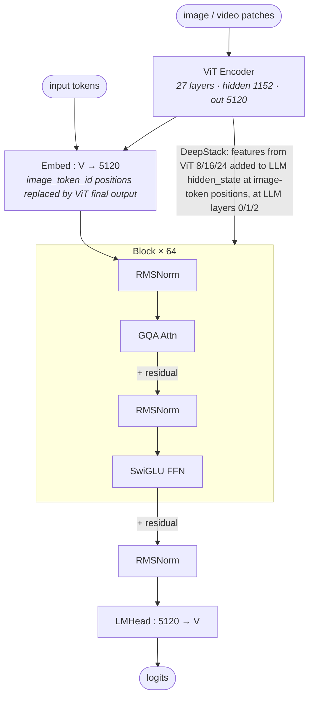

# Qwen3-VL 32B architecture (block-level)

## Model summary

| Field          | Value       |
|----------------|-------------|
| modality       | text+vision |
| attention_type | gqa         |
| ffn_type       | dense       |
| params         | 32B         |

`32B` covers the text-backbone parameter count (matching Qwen3-32B). The vision encoder (27-layer ViT, hidden=1152, intermediate=4304) adds roughly +0.4B parameters and is folded into deployment-time total counts but not included in the `params` field above — that field tracks the LLM-side scale consistent with the HF naming convention.

## Modules (in forward order)

| #   | Module                  | Type            | Count                | Detail        |
|-----|-------------------------|-----------------|----------------------|---------------|
| V1  | ViT Encoder + Merger    | vision-encoder  | 1                    | —             |
| V2  | DeepStack Mergers       | fusion          | 3 (at ViT 8/16/24)   | [[deepstack]] |
| 1   | Embed (text + visual)   | embed           | 1                    | —             |
| 2   | RMSNorm                 | norm            | 64                   | —             |
| 3   | GQA Attn                | attn            | 64                   | —             |
| 4   | RMSNorm                 | norm            | 64                   | —             |
| 5   | SwiGLU FFN              | ffn-dense       | 64                   | —             |
| 5d  | DeepStack inject (add)  | fusion          | 3 (at LLM 0/1/2)     | [[deepstack]] |
| 6   | RMSNorm                 | norm            | 1                    | —             |
| 7   | LMHead                  | head            | 1                    | —             |

V-prefixed rows run on the vision side **before** the LLM block loop begins; the LLM-side rows then run for every text + image token in interleaved order. Row 5d is an **in-place addition** at the image-token positions of the hidden state, applied at LLM layers 0 / 1 / 2 only — all other LLM layers (3 – 63) run without DeepStack injection.

## Key parameters

### Text backbone (LLM)

| Module | Param               | Value (Qwen3-VL-32B)         |
|--------|---------------------|------------------------------|
| —      | n_layers            | 64                           |
| —      | hidden              | 5120                         |
| —      | vocab               | 151936                       |
| GQA    | n_q_heads           | 64                           |
| GQA    | n_kv_heads          | 8                            |
| GQA    | head_dim            | 128                          |
| FFN    | intermediate_size   | 25600                        |
| —      | rope_theta          | 5,000,000                    |
| —      | rope_scaling        | mrope_interleaved, section [24,20,20] |
| —      | max_position        | 262144                       |
| —      | tie_word_embeddings | false                        |

### Vision encoder (ViT)

| Param                    | Value |
|--------------------------|-------|
| depth (n_layers)         | 27    |
| hidden_size              | 1152  |
| num_heads                | 16    |
| in_channels              | 3     |
| patch_size               | 16    |
| spatial_merge_size       | 2     |
| temporal_patch_size      | 2     |
| out_hidden_size          | 5120  |
| intermediate_size        | 4304  |
| hidden_act               | gelu_pytorch_tanh |
| num_position_embeddings  | 2304  |

### DeepStack

| Param                     | Value         |
|---------------------------|---------------|
| deepstack_visual_indexes  | [8, 16, 24]   |
| n_injection_points        | 3 (LLM layers 0, 1, 2) |

### Vision-related token ids

| Token                 | id      |
|-----------------------|---------|
| image_token_id        | 151655  |
| video_token_id        | 151656  |
| vision_start_token_id | 151652  |
| vision_end_token_id   | 151653  |

## Notes

- **Text backbone == Qwen3-32B dense** in all structural ways (`Qwen3VLTextModel` reuses `Qwen3DecoderLayer`-equivalent blocks). The differences from [[qwen3-dense-architecture]] are: (a) `model_type=qwen3_vl_text` instead of `qwen3`, (b) Interleaved-MRoPE rope scaling for multimodal position encoding, (c) extended `max_position_embeddings=262144` for long-video reasoning. Numbers like n_layers / hidden / heads / intermediate match exactly.
- **Vision → LLM input fusion** is the standard "replace at image_token_id" pattern: the ViT final-layer output goes through a spatial merger to produce 5120-dim tokens, which fill the positions marked by `image_token_id=151655` in the LLM embedding. Text tokens stay text-side.
- **DeepStack injects multi-level ViT features into the first 3 LLM layers** via element-wise addition at image-token positions. See [[deepstack]] for the verified forward-pass detail and per-step Mermaid. The injection is a position-masked add, not a concatenation or cross-attention.
- **Interleaved MRoPE** (`rope_scaling.mrope_interleaved=true`, `mrope_section=[24, 20, 20]`) allocates rotary frequencies across time, height, width — enabling unified position encoding for text + image + video tokens. This is a Qwen3-VL design choice on top of the otherwise-Qwen3-32B-equivalent text backbone.
- **`max_position=262144`** is the stock long-context size used by the family. Deployment may further extend via YARN-style scaling; that is not captured here.
- **Sibling MoE variant**: [[qwen3-vl-235b-a22b-architecture]] uses an MoE text backbone (Qwen3-235B-A22B style, top-8 of 128 routed experts, no shared expert) plus the same DeepStack mechanism on the same vision encoder.

## Source basis

Topology anchored to the InfraTech architecture image
(`model-architecture-diagram` skill, entry id `qwen3-vl-32b-architecture`,
file `models/qwen3_vl/qwen_3_vl_32b_architecture.jpg`).

Numerical fields verified against `Qwen/Qwen3-VL-32B-Instruct/config.json` on 2026-05-15 (top-level `model_type=qwen3_vl`, `architectures=Qwen3VLForConditionalGeneration`; nested `text_config.model_type=qwen3_vl_text`; nested `vision_config.model_type=qwen3_vl`; `deepstack_visual_indexes=[8, 16, 24]`).

DeepStack injection mechanism verified against the HF transformers reference modeling code at `src/transformers/models/qwen3_vl/modeling_qwen3_vl.py` on 2026-05-15: `Qwen3VLVisionModel.forward()` collects features from `self.deepstack_visual_indexes` and feeds them into `_deepstack_process()` inside the LLM decoder-layer loop, which performs `hidden_states[visual_pos_masks, :] += visual_embeds[layer_idx]` for `layer_idx ∈ range(len(deepstack_visual_embeds))` — i.e. the first 3 LLM layers.
