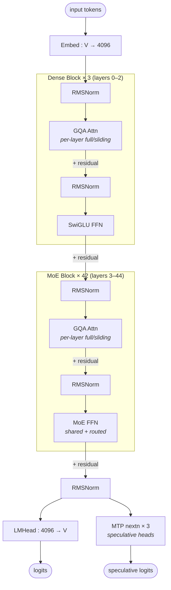

# Step 3.5 Flash architecture (block-level)

## Model summary

| Field          | Value             |
|----------------|-------------------|
| modality       | text              |
| attention_type | gqa               |
| ffn_type       | moe-shared+routed |
| params         | 196BA11B          |

## Modules (in forward order)

| #  | Module     | Type      | Count | Detail                |
|----|------------|-----------|-------|-----------------------|
| 1  | Embed      | embed     | 1     | —                     |
| 2  | RMSNorm    | norm      | 45    | —                     |
| 3  | GQA Attn   | attn      | 45    | —                     |
| 4  | RMSNorm    | norm      | 45    | —                     |
| 5  | SwiGLU FFN | ffn-dense | 3     | —                     |
| 5* | MoE FFN    | ffn-moe   | 42    | [[moe-shared-routed]] |
| 6  | RMSNorm    | norm      | 1     | —                     |
| 7  | LMHead     | head      | 1     | —                     |
| 8  | MTP nextn  | mtp       | 3     | —                     |

Rows 5 and 5* alternate by position: `moe_layers_enum="3,4,...,44"` — layers 0–2 use a dense SwiGLU FFN, layers 3–44 use the shared+routed MoE FFN. The GQA attention block at row 3 is identical across all 45 layers in shape, but each layer independently selects full vs sliding-window attention via `layer_types` (see Notes).

## Key parameters

| Module | Param                       | Value  |
|--------|-----------------------------|--------|
| —      | n_layers                    | 45     |
| —      | hidden                      | 4096   |
| —      | vocab                       | 128896 |
| —      | max_position_embeddings     | 262144 |
| GQA    | n_q_heads                   | 64     |
| GQA    | n_kv_heads (groups)         | 8      |
| GQA    | head_dim                    | 128    |
| GQA    | use_qk_norm                 | true   |
| GQA    | use_head_wise_attn_gate     | true   |
| GQA    | sliding_window              | 512    |
| GQA    | partial_rotary (full layers) | 0.5    |
| GQA    | partial_rotary (sliding)    | 1.0    |
| Dense FFN | intermediate_size        | 11264  |
| MoE    | n_routed_experts            | 288    |
| MoE    | n_shared_experts            | 1      |
| MoE    | top_k                       | 8      |
| MoE    | moe_intermediate_size       | 1280   |
| MoE    | share_expert_dim            | 1280   |
| MoE    | moe_router_activation       | sigmoid |
| MoE    | moe_router_scaling_factor   | 3.0    |
| MoE    | use_moe_router_bias         | true   |
| MoE    | active_per_token            | 9 (top-8 routed + 1 shared) |
| MTP    | num_nextn_predict_layers    | 3      |
| RoPE   | rope_theta (full layers)    | 5000000  |
| RoPE   | rope_theta (sliding layers) | 10000    |
| RoPE   | rope_scaling.rope_type      | llama3 |
| RoPE   | rope_scaling.factor         | 2.0    |
| —      | tie_word_embeddings         | false  |
| —      | torch_dtype                 | bfloat16 |

## Notes

- **Mixed dense / MoE FFN positions**: `moe_layers_enum` explicitly lists layers `3..44` as MoE, leaving the first 3 layers (0, 1, 2) with the dense SwiGLU FFN at `intermediate_size=11264`. Per authoring-policy § 4a the dominant variant (MoE, 42/45 layers) sets `ffn_type=moe-shared+routed`; the dense warm-up region is the exception. Structurally analogous to DeepSeek V3 (dense layers 1–3 + MoE 4–61), differing in `n_layers`, expert pool size, and head config.
- **Shared + routed MoE pattern**: every MoE layer combines a single always-on shared expert (`share_expert_dim=1280`) with top-8 of 288 routed experts (`moe_intermediate_size=1280`); see [[moe-shared-routed]] for the structural diagram. Combine formula and per-token activated-expert math are detailed in that file. Per-token active expert count is 9 (8 routed + 1 shared) — consistent with the `196BA11B` model-card figure (the activated-param count includes the per-layer GQA + the shared expert + 8 routed experts + embed/norm/head amortization).
- **Router specifics (per-model variation on `moe-shared-routed`)**: `moe_router_activation=sigmoid` (not softmax), `moe_router_scaling_factor=3.0` rescales the gating weights post-selection, and `use_moe_router_bias=true` enables a learned per-expert bias on the router logits — used for DeepSeek-style aux-loss-free load balancing. `need_fp32_gate=true` forces the gate computation in fp32 even when the rest of the model runs in bf16.
- **Sliding-window / full-attention interleaving** (per authoring-policy § 3 this is a *boundary rule, not topology* — encoded here, not in a separate diagram). `layer_types` is a length-48 list (45 backbone + 3 MTP) following the pattern `[full, sliding, sliding, sliding] × 12`; among the 45 backbone layers, **12 are full-attention** (layer indices 0, 4, 8, 12, 16, 20, 24, 28, 32, 36, 40, 44) and **33 are sliding-attention** with `sliding_window=512`. Equivalent to a roughly 3:1 SWA-to-full ratio (the model card describes it as "3:1 SWA"). KV-cache footprint at long context is dominated by the 12 full-attention layers; the 33 sliding layers cap KV per token at 512 positions.
- **Per-layer partial RoPE**: `partial_rotary_factors` is `[0.5, 1.0, 1.0, 1.0] × 12` — the 12 full-attention layers rotate only half of `head_dim` (64 of 128 dims), while the 33 sliding-attention layers apply RoPE to the full 128 dims. `rope_theta` is also per-layer: 5e6 on full-attention layers (long-range), 1e4 on sliding-attention layers (short-range). RoPE scaling is `llama3` style with `factor=2.0` and `original_max_position_embeddings=131072`, extending the trained context to `max_position_embeddings=262144` (256K) — matches the model card's stated context window.
- **Per-block attention head-count variation**: `attention_other_setting` declares an alternate `(num_attention_heads=96, num_attention_groups=8, head_dim=128)` profile for the `sliding_attention` layer kind, while the top-level fields `(num_attention_heads=64, num_attention_groups=8, head_dim=128)` describe `full_attention` layers. Both flavors are GQA with 8 KV groups; only `n_q_heads` differs (64 full / 96 sliding). This per-flavor head-count split widens the sliding (short-range) attention path while keeping the long-range full path narrower, but does **not** change the GQA structural pattern — hence `attention_type=gqa` rather than a hybrid tag.
- **QK-norm + head-wise output gate**: `use_qk_norm=true` applies RMSNorm to Q and K before the attention dot product; `use_head_wise_attn_gate=true` adds a per-head sigmoid gate on the attention output before W_O. Both are dimensional / boundary modifications of the standard GQA forward — not new structural fan-outs — so they live in Notes rather than in the diagram.
- **MTP (multi-token prediction) heads**: `num_nextn_predict_layers=3`. The model card describes this as "MTP-3" predicting 4 tokens per forward pass (the main LMHead plus 3 next-N speculative heads). Each MTP head reuses the same `lm_head` projection but is fed by an additional transformer layer attached to the trunk's final hidden state — distinct from the main LMHead computation graph, hence its own row in `## Modules`. The 3 extra entries in `layer_types`, `rope_theta`, and `partial_rotary_factors` (length 48 vs `num_hidden_layers=45`) belong to these MTP layers.
- **No vision tower**: `modality=text`; Step 3.5 Flash is a text-only LLM. The sibling family `Step3-VL-10B` is a separate VLM model and is not covered by this entry.
- **No tied embeddings**: `tie_word_embeddings=false` — Embed and LMHead are separate weight matrices.

## Source basis

Topology and counts transcribed from `stepfun-ai/Step-3.5-Flash/config.json`
(verified 2026-05-15: `architectures=["Step3p5ForCausalLM"]`, `model_type=step3p5`).
Forward-pass composition (Pre-LN RMSNorm → GQA → residual → RMSNorm → MoE/dense FFN → residual) verified against `modeling_step3p5.py`'s `Step3p5DecoderLayer.forward`, including the shared + routed MoE combine (`ffn_output = moe_output + share_output`) and the per-layer `layer_types`-driven attention mask selection.
MoE structural pattern shared with [[moe-shared-routed]]; per-model variations (sigmoid router activation, `moe_router_scaling_factor=3.0`, learned router bias, sliding/full attention interleaving with per-flavor head counts) noted above. Param counts (196.81B total, ~11B active) cross-checked with the verified model card; closest HF-style label is `params=196BA11B`.
