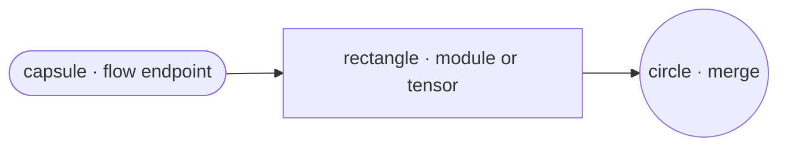

# Mermaid style guide

Conventions for diagrams stored in `references/diagrams/*.md`. Applies to all new entries.

## Direction

- Always `flowchart TD` (top-to-bottom). Transformer architectures are layer stacks, so vertical flow matches the mental model.
- Inside a `subgraph`, you may set `direction LR` only when the inner content is *naturally* a horizontal fan-out (e.g. a router dispatching to parallel experts). Default inside a subgraph is also `TB`.

## Abstraction ceiling

- Match the level of detail shown in the original architecture image (if there is one) — see the sibling `model-architecture-diagram` skill for reference.
- Do **not** drill below module level: no GEMM decomposition, no element-wise op breakdown, no kernel/tile-level steps.
- If a module deserves more detail than fits at the top-level, create a separate `.md` file (e.g. `deepseek-v3.2-mla.md`) and link to it from the top-level diagram via `[[id]]` and a Notes line.

## Node conventions

Three shapes, each with one role. No overlap.

| Role | Shape | Mermaid syntax |
|---|---|---|
| Flow endpoint (input / output of the diagram, e.g. `input tokens`, `logits`, `x`, `output`) | capsule (stadium) | `id([label])` |
| Module / op / projection / tensor | rectangle | `id[label]` |
| Merge / join / concat / fan-in | circle | `id((label))` |

Avoid the other Mermaid shapes (subroutine `[[ ]]`, cylinder `[( )]`, diamond `{ }`, hexagon `{{ }}`, parallelogram `[/ /]`, double-circle `((( )))`). Each extra shape forces the reader to decode another visual convention; sticking to three keeps the skill uniform across hundreds of future entries.

### Shape gallery

The three shapes side by side (renders on any Mermaid-aware viewer):



Use this as the canonical reference when picking a shape for a new node.

## Node label content (hard rules)

These rules keep module names and annotations visually distinct, and keep numerical params in a single source of truth.

**Module nodes** (modules / ops / projections in the data flow):

- **Bare name on the first line.** No parenthetical annotations attached. Example: `attn[MLA Attn]`, `moe[MoE FFN]`, `n1[RMSNorm]`.
- All numerical parameters (`n_heads`, `q_lora_rank`, `n_routed_experts`, ...) go into the `## Key parameters` table, not into node labels.
- **Annotations — `<br/><i>...</i>` italic line, never plain-text parentheticals.** When a module node needs *anything* beyond its bare name, attach a single italic line via HTML on a new line:

  | Annotation kind | Example |
  |---|---|
  | Distinguishing feature vs same-named module elsewhere | `moe["MoE FFN<br/><i>no shared expert</i>"]` |
  | Behavior summary | `routed["Routed Experts<br/><i>8 of 64 active per token</i>"]` |
  | Name elaboration | `WKR["W_KR<br/><i>k_rope projection</i>"]` or `router["Router<br/><i>W_g</i>"]` |

  Rules:
  - Module name stays bare on line 1; everything else lives in the `<br/><i>...</i>` line on line 2.
  - One italic line max per node.
  - **Never use plain-text parentheticals** like `Router (W_g)` — always italic.
  - Numerical parameter values (`q_lora=1536`) still belong in `## Key parameters`, not in italic lines.

**Tensor / data-flow nodes** (latent tensors named in the forward pass, e.g. `c_Q`, `q_nope`, intermediate activations):

- Format `name : shape` with `:` as separator (do not use `·` or `dim`).
- Examples:
  - `cQ["c_Q : 1536"]`
  - `q_nope["q_nope : 128h × 128"]`
  - `embed["Embed : V → 7168"]` (here shape arrow encodes the projection)
- Shape is part of the data-flow story, so it earns its place inside the label.

**Cross-cutting facts** (things true about the model but not localized to one node — "layers 1–3 use dense FFN", "KV cache stores c_KV+k_rope", "first 4 layers don't apply RoPE"):

- Always go into `## Notes`, never into node labels.

**Edge labels** (text on an arrow):

- Reserved for short structural annotations on the flow itself: `-->|+ residual|`, `-->|shared|`, `-->|top-8|`. Don't use edge labels for module parameters.

## Edges

- Default arrow `-->`.
- Residual sum: `-->|+ residual|` inline label. Use sparingly — one per residual stream is enough; don't tag every arrow.
- Cross-head broadcast / shared tensor: label the edge `-->|shared|` or note in `## Notes`.

## Repeated blocks

Repeated layer stacks (`Block × N`) live inside a `subgraph` with explicit count in the label:

```
subgraph block ["Block × 61"]
    direction TB
    n1[RMSNorm]
    attn[MLA Attn]
    ...
end
```

External edges enter the first inner node and exit from the last:

```
embed --> n1
moe -->|+ residual| fnorm
```

Don't draw `Block × N` as a single rectangle with `× N` in the label — losing the inner topology defeats the point of the diagram.

## Sections in each entry file

Fixed order. Block-level diagrams use all sections; module-detail diagrams omit `## Model summary` and `## Modules`.

| # | Section | Block-level | Module-detail | What it carries |
|---|---|---|---|---|
| 1 | Frontmatter (id, title, aliases, rank, `modality`, `attention_type`, `ffn_type`, source_basis) | ✓ | ✓ (no model-level tags) | Machine-readable metadata |
| 2 | Top-level heading `# <Title>` | ✓ | ✓ | — |
| 3 | `## Model summary` table | ✓ | — | Model-level orthogonal tags + scale numbers (modality, attention_type, ffn_type, total_params, active_params) |
| 4 | Mermaid `flowchart TD` block | ✓ | ✓ | The diagram itself, no narration before it |
| 5 | `## Modules (in forward order)` table | ✓ | — | Per-module `type` tag + `Count` column = forward-pass instantiations |
| 6 | `## Key parameters` table | ✓ | ✓ | Detailed numerical fields (lora ranks, head dims, intermediate sizes) |
| 7 | `## Notes` | ✓ | ✓ | Quirks not in the graph: dense-vs-MoE ranges, KV cache shape, RoPE specifics, routing rules, cross-refs via `[[id]]` |
| 8 | `## Source basis` | ✓ | ✓ | Pointers to reference image (if any), `config.json`, `modeling_*.py` |

### `## Model summary` shape

```
| Field          | Value             |
|----------------|-------------------|
| modality       | text              |
| attention_type | mla               |
| ffn_type       | moe-shared+routed |
| params         | 671BA37B          |
```

`modality`, `attention_type`, and `ffn_type` are three **orthogonal** axes; each value comes from its own closed vocabulary in `authoring-policy.md` § 4a. Do not collapse them into a single combined tag — downstream agents filter on each axis independently.

`params` value format (single field, matches HF naming conventions like Qwen3-235B-A22B, DeepSeek-V3-671B-A37B):

- **Dense models**: `<total>B` — e.g. `7B`, `70B`, `405B`.
- **MoE models**: `<total>BA<active>B` — e.g. `671BA37B`, `235BA22B`, `30BA3B`.
- **Mixed-FFN models** (e.g. DeepSeek V3 with dense layers 1–3 + MoE 4–61): use the MoE form; the dense-layer parameter contribution is part of `<total>`.

Fields explicitly excluded from `## Model summary`:

- `context_length` — deployment-specific; the stock HF max position embedding rarely matches the served context.
- `precision` — virtually all in-scope models ship bf16 stock; the field doesn't differentiate.
- Separate `total_params` / `active_params` — collapsed into the single `params` field above.

Anything deployment-specific belongs to the downstream agent's overlay, not to this prior.

### `## Modules` shape

```
| # | Module    | Type    | Count |
|---|-----------|---------|-------|
| 1 | Embed     | embed   | 1     |
| 2 | RMSNorm   | norm    | 61    |
| 3 | MLA Attn  | attn    | 61    |
| 4 | RMSNorm   | norm    | 61    |
| 5 | MoE FFN   | ffn-moe | 58    |
| 5*| Dense FFN | ffn-dense | 3   |
| 6 | RMSNorm   | norm    | 1     |
| 7 | LMHead    | head    | 1     |
```

Row order = forward-pass execution order. `Type` values come from the closed vocabulary in `authoring-policy.md` § 4a. `Count` is the number of times the module is instantiated across the whole forward pass (1 for one-shot model-boundary modules; `n_layers` for per-block modules; partials when a position alternates between implementations).

When a position has alternating implementations (e.g. dense FFN at layers 1–3, MoE FFN at layers 4–61), write them as `5` and `5*` rows; below the table, note the position-to-layer mapping in one prose line.

## Naming

- `id`: kebab-case slug, matches filename without `.md`. Examples: `deepseek-v3.2-architecture`, `deepseek-v3.2-mla`, `qwen3-moe-block`.
- `title`: human-readable, include the model name and what level the diagram is at. Examples: `DeepSeek V3.2 architecture (block-level)`, `DeepSeek V3.2 MLA forward`, `Qwen3 MoE block`.
- `aliases`: include HF id, colloquial names, common variants. If two models share architecture (DeepSeek V3 ↔ R1), share aliases on the same entry.

## Cross-references

- Wiki-style `[[other-id]]` inside Notes or Source basis.
- The resolver will **not** auto-expand `[[id]]`; the reader (human or agent) re-invokes the skill if they want the linked diagram.

## Width budget

Mermaid auto-layouts, but keep node labels under ~30 characters. Long parameter lists belong in the `## Key parameters` table, not in node labels.
